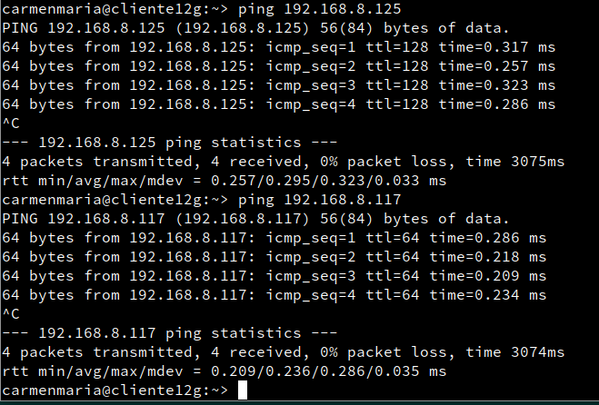
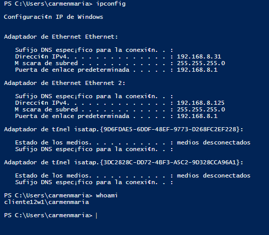
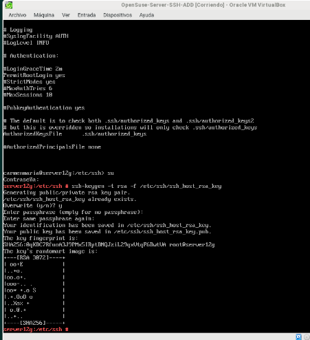
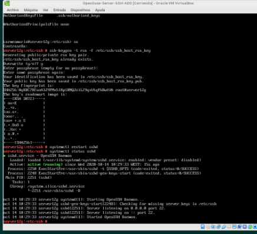
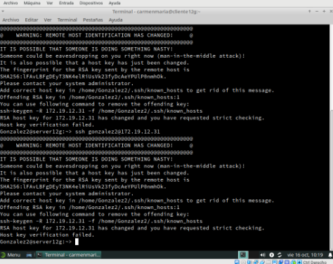

# Acceso remoto SSH

# Servidor SSH

## Preparativos

## 1º-Configurar las MV

## 1.1-Sevidor  GNU/Linux

-SO GNU/Linux: OpenSUSE - Sin entorno gráfico.

-Añadir en /etc/hosts los equipos clientXXg y clientXXw (Donde XX es el puesto del alumno). XX=12
sudo nano /etc/hosts
-Nombre de cada equipo:

**server12g, cliente12g y server12w, cliente12w**

-Configuraciones de las MVs

**server12g:** ip casa: 192.168.8.117; ip clase: 172.19.12.31, Gateway: 192.168.8.1, 172.19.0.1
DNS: server12g,  server12g.curso2021

## 1.2 Cliente GNU/Linux
**cliente12g:** ip casa: 192.168.8.118; ip clase: 172.19.12.32,  Gateway: 192.168.8.1, 172.19.0.1
DNS: cliente12g,  cliente12g.curso2021

Añadir en /etc/hosts los equipos serverXXg, y clientXXw.
Comprobar haciendo ping a ambos equipos.

**server12w:** ip casa: 192.168.8.32; ip clase: 172.19.12.12,  Gateway: 192.168.8.1, 172.19.0.1

## 1.3 Cliente Windows
**cliente12w:** ip casa: 192.168.8.31; ip clase: 172.19.12.13,  Gateway: 192.168.8.1, 172.19.0.1

-Instalar software cliente SSH en Windows. Para este ejemplo usaremos PuTTY.

-Añadir en C:\Windows\System32\drivers\etc\hosts los equipos serverXXg y clientXXg.
Comprobar haciendo ping a ambos equipos.

>Nota: como teníamos que pasar las MV de casa a clase y biseversa puede producirse algún cambio para que pudiera haber conexión.

## 1.1.1-Crear los siguientes usuarios en server12g:

comandos:
usuarios: useradd -m -----
contraseña: passwd -----

    primer-apellido-del-alumno1  **Hernández1**
    primer-apellido-del-alumno2   **González2**
    primer-apellido-del-alumno3   **Garcia3**
    primer-apellido-del-alumno4   **Fuentes4**

# 2 Instalación del servicio SSH en GNU/Linux
Instalar el servicio SSH en la máquina serverXXg. Por comandos o entorno gráfico.

-Se ha utilizado por comandos :

-Desde terminal *zypper search openssh* muestra los paquetes instalados o no con nombre openssh*.

-Desde terminal *zypper install openssh*, instala el paquete OpenSSH.

## 2.1 Comprobación

-Desde el propio servidor, verificar que el servicio está en ejecución.

    -*systemctl status sshd*, esta es la forma habitual de comprobar los servicios.

    -*ps -ef|grep sshd*, esta es otra forma de comprobarlo mirando los procesos del sistema.

>Nota: *ps -ef* muestra todos los programas que se están ejecutando en ese momento.

-Para poner el servicio enable, si no lo estuviera.:
*systemctl enable sshd*

-*sudo lsof -i:22*, comprobar que el servicio está escuchando por el puerto 22.

>Nota: el comamndo *Lsof*
y *netstat -n* hacen lo mismo ven si las conexiones están establecidas.

## 2.2 Primera conexión SSH desde cliente GNU/Linux

    -Ir al cliente clientXXg.

    -*ping serverXXg*, comprobar la conectividad con el servidor.

    -*nmap -Pn serverXXg*, comprobar los puertos abiertos en el servidor (SSH debe estar open). Debe mostrarnos que el puerto 22 está abierto. Debe aparecer una línea como "22/tcp open ssh".

    Si esto falla, debemos comprobar en el servidor la configuración del cortafuegos.

  

  -Vamos a comprobar el funcionamiento de la conexión SSH desde cada cliente usando el usuario 1er-apellido-alumno1.

-Desde el cliente GNU/Linux nos conectamos mediante ssh 1er-apellido-alumno1@serverXXg.

**ssh Hernandez1@192.168.8.117**

 Capturar imagen del intercambio de claves que se produce en el primer proceso de conexión SSH.

 >Nota: El servidor crea un par de claves pública/privadas sin decir nada.

 

A partir de ahora cuando nos conectamos sólo nos pide la contraseña:

 

  -Comprobar contenido del fichero $HOME/.ssh/known_hosts en el equipo cliente. OJO el prompt nos indica en qué equipo estamos.

  -¿Te suena la clave que aparece? Es la clave de identificación de la máquina del servidor.

  -Una vez llegados a este punto deben de funcionar correctamente las conexiones SSH desde el cliente. Comprobarlo.

 

 ## 2.3 Primera conexión SSH desde cliente Windows

-Desde el cliente Windows nos conectamos usando PuTTY.

-Podremos ver el intercambio de claves que se produce en el primer proceso de conexión SSH. * ¿Te suena la clave que aparece? Es la clave de identificación de la máquina del servidor.

-Guardar la identificación del servidor.

-La siguiente vez que volvamos a usar PuTTY ya no debe aparecer el mensaje de advertencia porque hemos memorizado la identificación del servidor SSH. Comprobarlo

 

# 3. Cambiamos la identidad del servidor

¿Qué pasaría si cambiamos la identidad del servidor? Esto es, ¿Y si cambiamos las claves del servidor? ¿Qué pasa?

Los ficheros ssh_host key y ssh_host key.pub, son ficheros de clave pública/privada que identifican a nuestro servidor frente a nuestros clientes. Confirmar que existen el en /etc/ssh,:

-Modificar el fichero de configuración SSH *(/etc/ssh/sshd_config)* para dejar una única línea: *HostKey /etc/ssh/ssh_host_rsa_key*.

 -Comentar el resto de líneas con configuración HostKey. Este parámetro define los ficheros de clave publica/privada que van a identificar a nuestro servidor. Con este cambio decimos que sólo se van a utilizar las claves del tipo RSA.

 ## 3.1 Regenerar certificados

 Vamos a cambiar o volver a generar nuevas claves públicas/privadas que identifican nuestro servidor.

    -Ir al servidor.

    -Como usuario root ejecutamos: ssh-keygen -t rsa -f /etc/ssh/ssh_host_rsa_key. ¡OJO! No poner password al certificado.

        

    -Reiniciar el servicio SSH: systemctl restart sshd.

    -Comprobar que el servicio está en ejecución correctamente: systemctl status sshd

    

    ## 3.2 Comprobamos

    -Comprobar qué sucede al volver a conectarnos desde los dos clientes, usando los usuarios 1er-apellido-alumno2 **Gonzalez2** y 1er-apellido-alumno1 **Hernandez1**.
    -*ssh Hernandez1@server12g* o *ssh Hernandez1@192.168.8.117*

    -*ssh Gonzalez2@server12g* o *ssh Gonzalez2@192.168.8.117*

     ¿Qué sucede?

>Nota: Nos dice que las claves han sido cambiadas
Da un mensaje de alerta al primer alumno1 que quiere conectarse y no se lo permite,
entonces leemos y copiamos la clave para que funcione.
Se ha generado nueva clave para acceder al servidor.
-volvemos a ajecutar la conexión y nos permite acceder.

## 4. Personalización del prompt Bash

-Por ejemplo, podemos añadir las siguientes líneas al fichero de configuración del 1er-apellido-alumno1 en la máquina servidor (Fichero /home/1er-apellido-alumno1/.bashrc)

**sudo nano /home/Hernandez1/.bashrc**

 Se cambia el prompt al conectarse vía SSH

if [ -n "$SSH_CLIENT" ]; then
   PS1="AccesoRemoto_\e[32m\u@\h:\e[0m \w\a\$ "
else
   PS1="\[$(pwd)\]\u@\h:\w>"
fi

-Además, crear el fichero el fichero /home/1er-apellido-alumno1/.alias, donde pondremos el siguiente contenido:

**sudo nano /home/Hernandez1/.alias**

alias c='clear'
alias g='geany'
alias p='ping'
alias v='vdir -cFl'
alias s='ssh'

-Comprobar funcionamiento de la conexión SSH desde cada cliente.

## 5. Autenticación mediante claves públicas

Explicación:

El objetivo de este apartado es el de configurar SSH para poder acceder desde el clientXXg sin necesidad de escribir la clave. Usaremos un par de claves pública/privada.

Para ello, vamos a configurar la autenticación mediante clave pública para acceder con nuestro usuario personal desde el equipo cliente al servidor con el usuario 1er-apellido-alumno4. Vamos a verlo.

-Vamos a la máquina clientXXg.

-Iniciamos sesión con nuestro el usuario nombre-alumno  **carmenmaria** de la máquina clientXXg **cliente12g**

ssh-keygen -t rsa para generar un nuevo par de claves para el usuario en:

    /home/nombre-alumno/.ssh/id_rsa
    /home/nombre-alumno/.ssh/id_rsa.pub

Ahora vamos a copiar la clave pública (id_rsa.pub), al fichero "authorized_keys" del usuario remoto 1er-apellido-alumno4 **Fuentes4** que está definido en el servidor.

El modo recomendado es usando el comando ssh-copy-id. Ejemplo para copiar la clave pública del usuario actual al usuario remoto en la máquina remota: ssh-copy-id 1er-apellido-alumno4@serverXXg   **ssh-copy-id Fuentes4@server12g**

Comprobar que ahora al acceder remotamente vía SSH

    Desde clientXXg  **cliente12g**, NO se pide password.
    Desde clientXXw  **cliente12w**, SI se pide el password.

  

## 6. Uso de SSH como túnel para X

-Instalar en el servidor una aplicación de entorno gráfico (APP1) que no esté en los clientes. Por ejemplo **Geany**. Si estuviera en el cliente entonces buscar otra aplicación o desinstalarla en el cliente.

-Modificar servidor SSH para permitir la ejecución de aplicaciones gráficas, desde los clientes. Consultar fichero de configuración /etc/ssh/sshd_config (Opción X11Forwarding yes)

  
    

-Reiniciar el servicio SSH para que se lean los cambios de configuración.

  

  Vamos a clientXXg.

  -zypper se APP1,comprobar que no está instalado el programa APP1  **geany**.

  

  Vamos a comprobar desde clientXXg, que funciona APP1(del servidor).

  ssh -X primer-apellido-alumno1@serverXXg, **ssh -X Hernandez1@serverXXg**  nos conectamos de forma remota al servidor, y ahora ejecutamos APP1 **geany** de forma remota.
      ¡OJO! El parámetro es -X en mayúsculas, no minúsculas.

  

## 7. Aplicaciones Windows nativas  

Podemos tener aplicaciones Windows nativas instaladas en ssh-server mediante el emulador WINE.

-Instalar emulador Wine en el serverXXg.

-Ahora podríamos instalar alguna aplicación (APP2) de Windows en el servidor SSH usando el emulador Wine. O podemos usar el Block de Notas que viene con Wine: wine notepad.

-Comprobar el funcionamiento de APP2 en serverXXg.

-Comprobar funcionamiento de APP2, accediendo desde clientXXg.

>Nota: Desde el servidor no funciona pues no tiene entorno gráfico, pero haciendo una conexión ssh desde cliente, al este tener entorno gráfico si funciona.

En la máquina cliente, hacemos una conexión remota con:

 **SSH -X Hernandez1@server12g**

 **wine notepad**
 

## 8. Restricciones de uso

Vamos a modificar los usuarios del servidor SSH para añadir algunas restricciones de uso del servicio.

## 8.1 Restricción sobre un usuario

Vamos a crear una restricción de uso del SSH para un usuario:

-En el servidor tenemos el usuario primer-apellido2 **Gonzalez2**. Desde local en el servidor podemos usar sin problemas el usuario.

-Vamos a modificar SSH de modo que al usar el usuario por SSH desde los clientes tendremos permiso denegado.

Capturar imagen de los siguientes pasos:

-Consultar/modificar fichero de configuración del servidor SSH (*nano /etc/ssh/sshd_config*) para restringir el acceso a determinados usuarios. Consultar las opciones AllowUsers, DenyUsers (Más información en: *man sshd_config*)

*/usr/sbin/sshd -t; echo $?*, comprobar si la sintaxis del fichero de configuración del servicio SSH es correcta (Respuesta 0 => OK, 1 => ERROR).

>Nota: Reinicié las MVs para que funcionara la restricción.

Comprobarlo la restricción al acceder desde los clientes.

## 8.2 Restricción sobre una aplicación

Vamos a crear una restricción de permisos sobre determinadas aplicaciones.

-Crear grupo remoteapps

**groupadd remoteapps**

-Incluir al usuario 1er-apellido-alumno4 en el grupo remoteapps.

**usermod -a -G remoteadds Fuentes4**

-Localizar el programa APP1 **geany**. Posiblemente tenga permisos 755.

**whereis geany**

**vdir /usr/bin/geany**

**vdir /usr/bin/ | grep geany**

-Poner al programa APP1 el grupo propietario a remoteapps.

**cd /usr/bin**

**chgrp remoteapps geany**

-Poner los permisos del ejecutable de APP1 a 750. Para impedir que los usuarios que no pertenezcan al grupo puedan ejecutar el programa.

**chmod 750 geany**

-Comprobamos el funcionamiento en el servidor en local.

**exit**

**geany**

-Comprobamos el funcionamiento desde el cliente en remoto (Recordar ssh -X ...).

**ssh -X Fuentes4@192.168.8.117**

## 9. Servidor SSH en Windows

--Configurar el servidor Windows con los siguientes valores:

Añadir en
 C:\Windows\System32\drivers\etc\hosts

-Instalar y configurar el servidor SSH en Windows.

-Elegir la opción que se quiera: OpenSSH o integrado.
Para instalarlo seguimos los siguientes pasos:

-Descargar la última versión de OpenSSH-Win64.zip.

-Descomprimir en **C:\Program files\OpenSSH**. En caso de haber descargado la versión de 32 bits (OpenSSH-Win32), extraer el contenido del ZIP en C:\Program files\OpenSSH (x86).

-PS>**cd ‘C:\Program files\OpenSSH’**, Iniciar PowerShell como Administrador y movernos hasta C:\Program files\OpenSSH:

-Ejecutar el script para instalar los servicios “sshd” y “ssh-agent”:

PS> Set-ExecutionPolicy –ExecutionPolicy Bypass
PS> .\install-sshd.ps1

-Documentar el proceso de instalación y configuración

-Al terminar debe indicar que los servicios se han instalado de forma satisfactoria. Podemos comprobar que se han instalado los servicios con el siguiente comando:

    PS> Get-Service sshd,ssh-agent

-Generar las claves (certificados) del servidor:

PS> .\ssh-keygen.exe –A
PS> .\FixHostFilePermissions.ps1 -Confirm:$false

    Habilitar la regla de nombre “SSH” en el Firewall de Windows para permitir (Allow) conexiones TCP entrantes (Inbound) en el puerto 22 (SSH): PS> New-NetFirewallRule -Protocol TCP -LocalPort 22 -Direction Inbound -Action Allow -DisplayName SSH
    Configuramos los servicios para que inicien automáticamente:

PS> Set-Service sshd -StartupType Automatic
PS> Set-Service ssh-agent -StartupType Automatic

    Iniciamos el servicio: PS> Start-Service sshd

-Comprobar acceso SSH desde los clientes Windows y GNU/Linux al servidor SSH Windows.

netstat -n en Windows.
lsof -i -n en GNU/Linux.

SO Windows Server  Nombre de equipo: server12w
