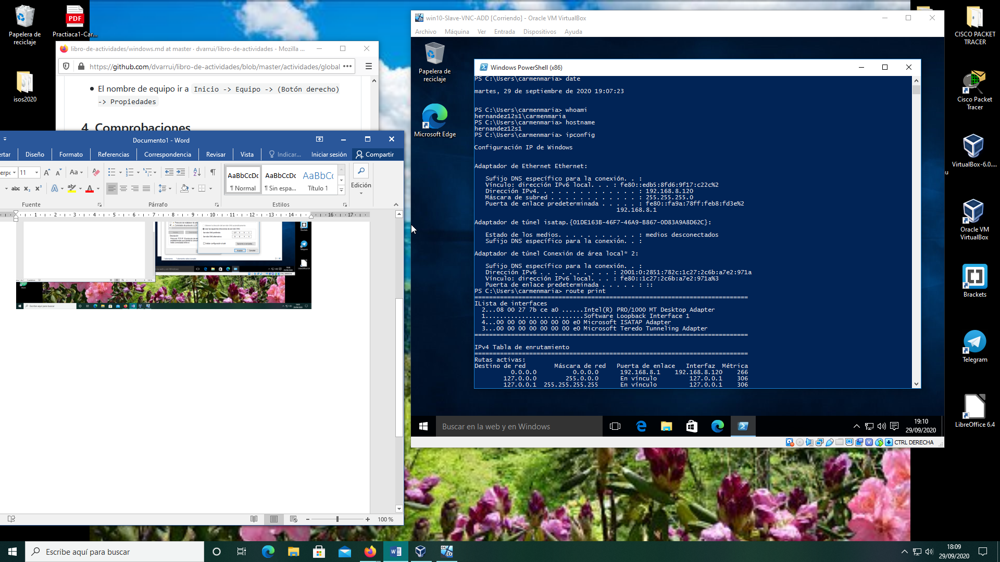
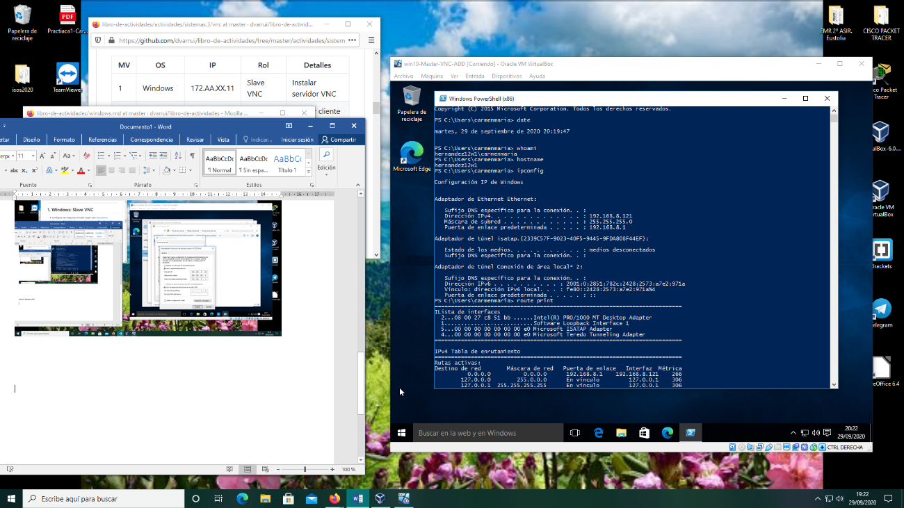
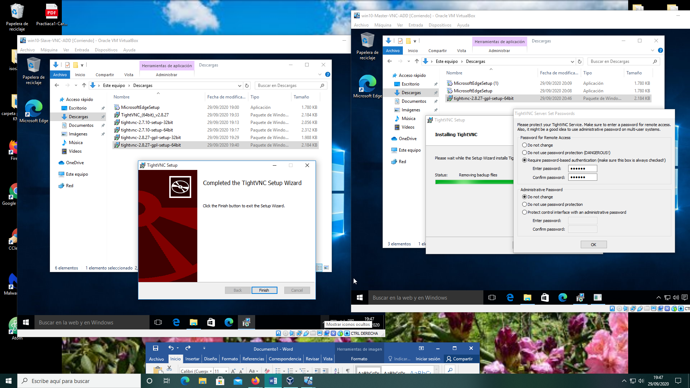
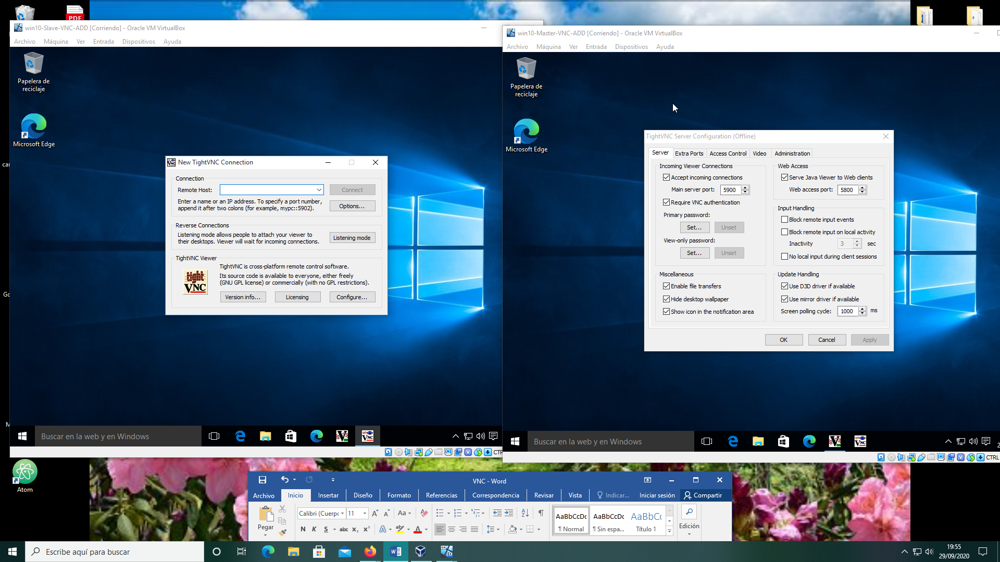
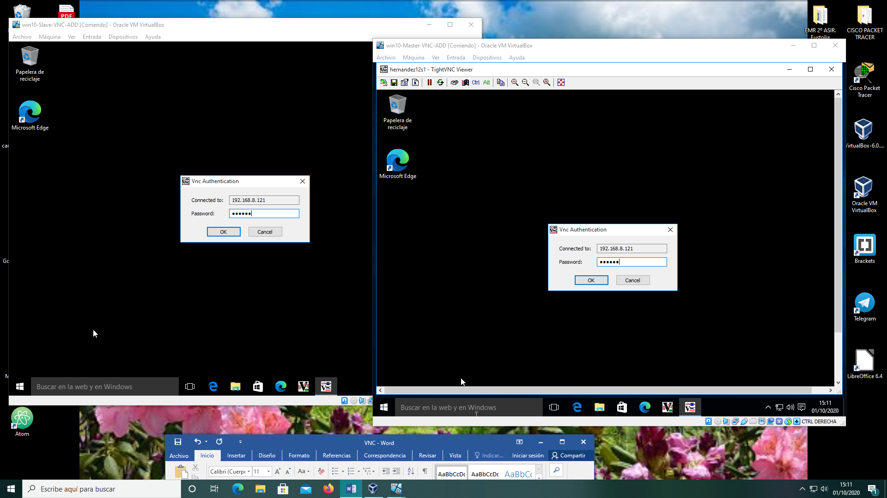
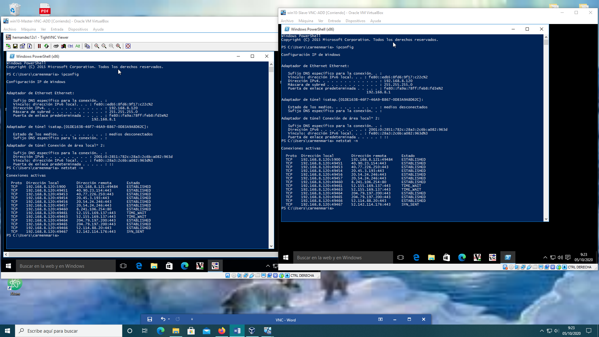

**#CONEXIÓN REMOTA VNC#**

>Se utilizarán dos MV de Windows 10
>1: Windows:Slave.
>2: Windoows:Master

 **1. Windows: Slave VNC**

 1º Configurar MV

 -IP estática, según la red en la que estemos trabajando (casa o colegio)

 -Nomjbre del usuario, nombre del equipo, grupo de trabajo al que pertenece.

 

 2º Descargar *TightVNC server*

 3º Instalarlo

 4º Revisar la configuración del cortafuegos del servidor.

 **2. Windows: Master VNC**

 1º Configurar MV

 -Se realizarán los mismos pasos que en la MV anterior.

 2º Descargar *Tightvnc Viewer*

 > Los dos servidores deben ser de la misma marca para poder conectarse.

 3º Instalarlo

 

 

 -Utilisé la Ip de una de las dos MV para conectarme a la otra.
 Se conectó el servidor slave al cliente Master.

 

 4º Comprobar con el comando *netstat -n* en una de las dos MV la conexión entre  ambas MV.

