#**Samba con OpenSUSE y Windows**

##**1. Servidor Samba (MV1)**

  -  Configurar el servidor GNU/Linux.

  >NOTA: He utilizado la MV de la prática de SSH pero se le ha instalado entorno gráfico usando los comandos:
  **zypper install patterns-xfce-xfce** entrando como usuario root
  Después en **yast** servicios-destino- seleccionamos : Interfaz gráfica-salimos y ponemos reboot (reiniciar a lo bruto).

  -  Nombre de equipo: serverXXg **server12g**.

  -  Añadir en /etc/hosts los equipos clientXXg **cliente12g** y clientXXw **cliente12w**.

##**1.2 Usuarios locales**

Vamos a GNU/Linux, y creamos los siguientes grupos y usuarios locales:

  -  Crear los grupos **piratas**, **soldados** y **sambausers**.

  -  Crear el usuario **smbguest**. Para asegurarnos que nadie puede usar sambaguest para entrar en nuestra máquina mediante login, vamos a modificar este usuario y le ponemos como shell /bin/false. NOTA: Podemos hacer estos cambios por entorno gráfico usando Yast, o por comandos editando el fichero /etc/passwd.

  -  Dentro del grupo **piratas**

  incluir a los usuarios **pirata1**, **pirata2** y **supersamba**.

  -  Dentro del grupo **soldados**

  incluir a los usuarios **soldado1** , **soldado2** y **supersamba**.

  -  Dentro del grupo **sambausers**,

   poner a todos los usuarios **soldados**, **piratas**, **supersamba** y a **smbguest**.

##**1.3 Crear las carpetas para los futuros recursos compartidos**

  -  Creamos la carpeta base para los recursos de red de Samba de la siguiente forma:
        **mkdir /srv/samba12**
        **chmod 755 /srv/samba12**
  -  Vamos a crear las carpetas para los recursos compartidos de la siguiente forma:

  Recurso 	Directorio 	Usuario 	Grupo 	Permisos
Public 	/srv/sambaXX/public.d 	supersamba 	sambausers 	770

Castillo 	/srv/sambaXX/castillo.d 	supersamba 	soldados 	770

Barco 	/srv/sambaXX/barco.d 	supersamba 	piratas 	770

##**1.4 Configurar el servidor Samba**

    -  **cp /etc/samba/smb.conf /etc/samba/smb.conf.bak**, hacer una copia de seguridad del fichero de configuración antes de modificarlo.

    -  Yast -> Samba Server

          Workgroup: curso2021

          Sin controlador de dominio.

    -  En la pestaña de Inicio definimos

          Iniciar el servicio durante el arranque de la máquina.

          Ajustes del cortafuegos -> Abrir puertos

  

##**1.5 Crear los recursos compartidos de red**

Vamos a configurar los recursos compartidos de red en el servidor. Podemos hacerlo modificando el fichero de configuración o por entorno gráfico con Yast.

  -  Tenemos que conseguir una configuración con las secciones: global, public, barco, y castillo como la siguiente:

        Donde pone XX, sustituir por el número del puesto de cada uno.

        **public**, será un recurso compartido accesible para todos los usuarios en modo lectura.

        **barco**, recurso compartido de red de lectura/escritura para todos los piratas.

        **castillo**, recurso compartido de red de lectura/escritura para todos los soldados.

  -  Podemos modificar la configuración:

        (a) Editando directamente el ficher /etc/samba/smb.conf o

        **nano /etc/samba/smb.conf**

        (b) Yast -> Samba Server -> Recursos compartidos -> Configurar.

  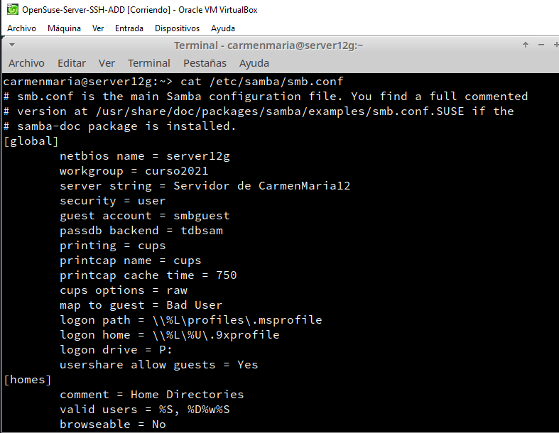

  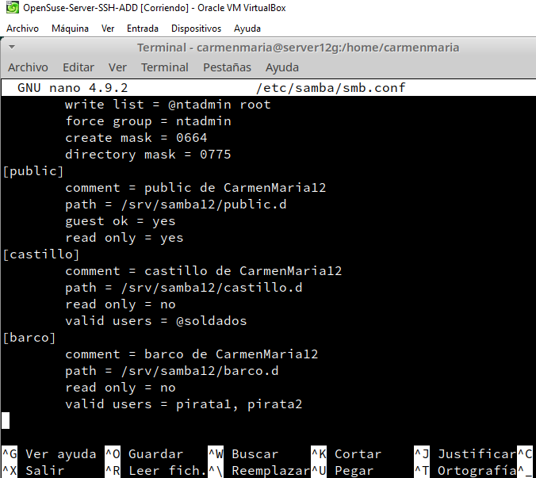

- **testparm**, verificar la sintaxis del fichero de configuración.

- **more /etc/samba/smb.conf**, consultar el contenido del fichero de configuración.

  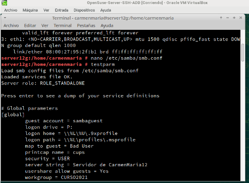

##**1.6 Usuarios Samba**

Después de crear los usuarios en el sistema, hay que añadirlos a Samba.

  -  smbpasswd -a USUARIO, para crear clave Samba de USUARIO.

        ¡OJO!: NO te saltes este paso.
        USUARIO son los usuarios que se conectarán a los recursos compartidos SMB/CIFS.

        Esto hay que hacerlo para cada uno de los usuarios de Samba.

  -  pdbedit -L, para comprobar la lista de usuarios Samba.

  

##**1.7 Reiniciar**  

  -  Ahora que hemos terminado con el servidor, hay que recargar los ficheros de configuración del servicio. Esto es, leer los cambios de configuración. Podemos hacerlo por Yast -> Servicios, o usar los comandos:

   **systemctl restart smb** y **systemctl restart nmb**.

  -  **sudo lsof -i**, comprobar que el servicio SMB/CIF está a la escucha.

#**2.Windows**

    -Configurar el cliente Windows.

    -Usar nombre y la IP que hemos establecido al comienzo.

    -Configurar el fichero ...\etc\hosts de Windows.

    -En los clientes Windows el software necesario viene preinstalado.

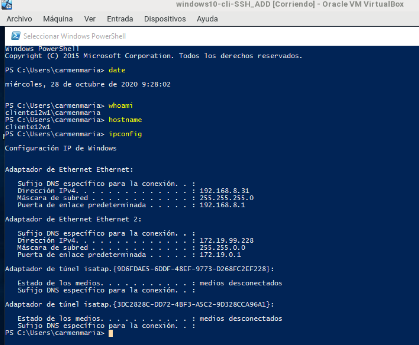

##**2.1 Cliente Windows GUI**

Desde un cliente Windows vamos a acceder a los recursos compartidos del servidor Samba.

    Escribimos \\ip-del-servidor-samba y vemos lo siguiente:

    Vamos al explorador de archivos - red  

    **\\172.19.12.31**

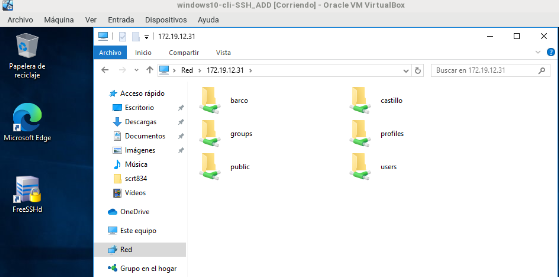

  -  Acceder al recurso compartido con el usuario invitado.

   Hacemos clic sobre cada carpeta (castillo, barco, public)y después en cmd o power shell escribimos los comandos:

        **net use** para ver las conexiones abiertas.

        **net use * /d /y**, para borrar todas las conexión SMB/CIFS que se hadn realizado.

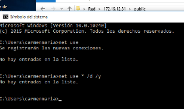  

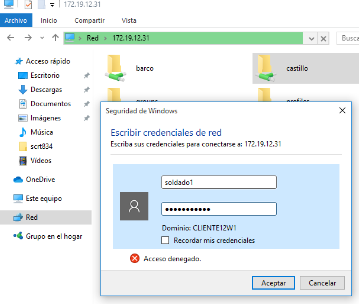  

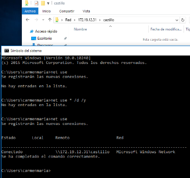

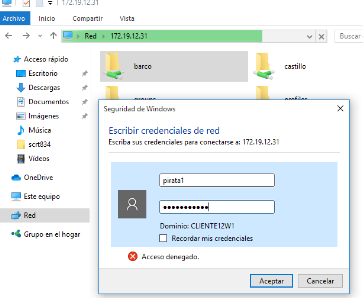  

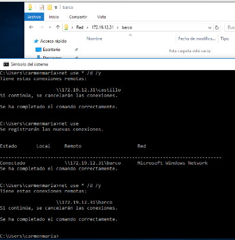   

  -  Acceder al recurso compartido con el usuario soldado

        **net use** para ver las conexiones abiertas.

        **net use * /d /y**, para borrar todas las conexión SMB/CIFS que se hadn realizado.

  -  Acceder al recurso compartido con el usuario pirata

  -  Ir al servidor Samba.

  -  Capturar imagen de los siguientes comandos para comprobar los resultados:

        **smbstatus**, desde el servidor Samba.

  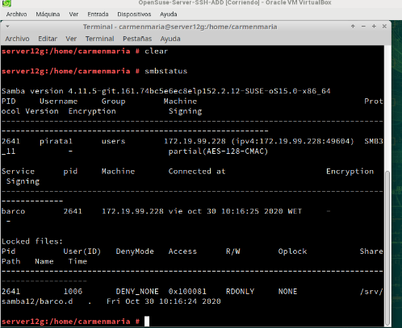      

        **lsof -i**, desde el servidor Samba.

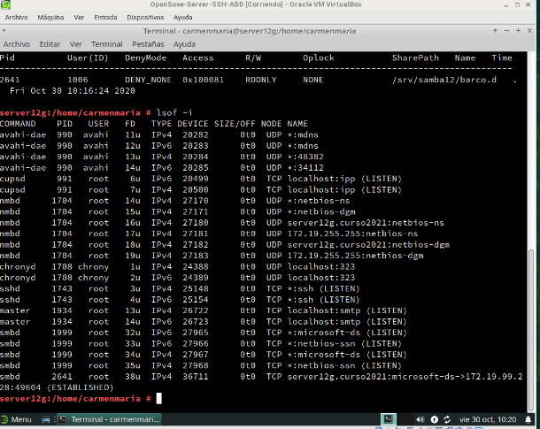  

#**2.2 Cliente Windows comandos**

  -  Abrir una shell de windows.

  -  **net use**, para consultar todas las conexiones/recursos conectados hacemos.
   Con **net use /?**, podemos consultar la ayuda.

   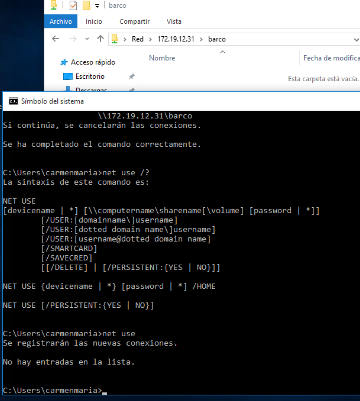

  -  Si hubiera alguna conexión abierta la cerramos.

        **net use * /d /y**, para cerrar las conexiones SMB.
        net use ahora vemos que NO hay conexiones establecidas.

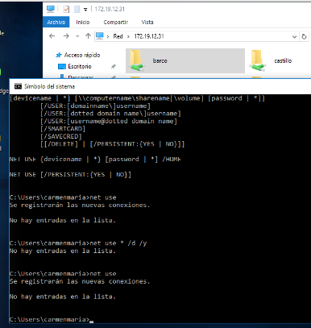

- Capturar imagen de los comandos siguientes:

    net view \\IP-SERVIDOR-SAMBA, para ver los recursos de esta máquina.

    **net view \\172.19.12.31**

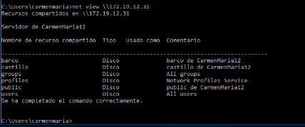

- Montar el recurso **barco** de forma persistente.

  -  net use S: \\IP-SERVIDOR-SAMBA\recurso contraseña /USER:usuario /p:yes crear una conexión con el recurso compartido y lo monta en la unidad S. Con la opción /p:yes hacemos el montaje persistente. De modo que se mantiene en cada reinicio de máquina.

  **net use S: \\172.19.12.31\barco /USER:pirata1 /p:yes**

  -  net use, comprobamos.

  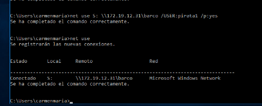

  -  Ahora podemos entrar en la unidad S ("s:") y crear carpetas, etc.

  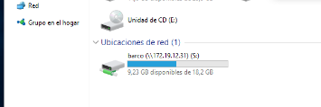

  -  Capturar imagen de los siguientes comandos para comprobar los resultados:

        smbstatus, desde el servidor Samba.
        lsof -i, desde el servidor Samba.

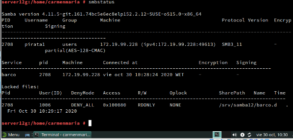

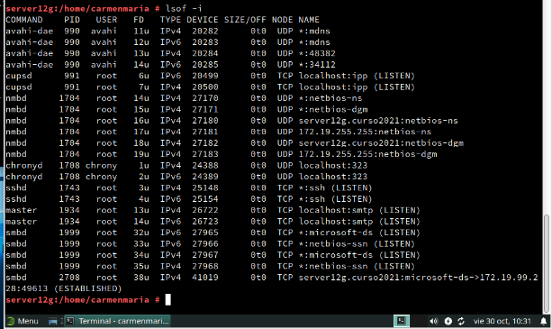

#**3. Cliente GNU/Linux**
•	Configurar el cliente GNU/Linux.
•	Usar nombre y la IP que hemos establecido al comienzo.
•	Configurar el fichero /etc/hosts de la máquina.

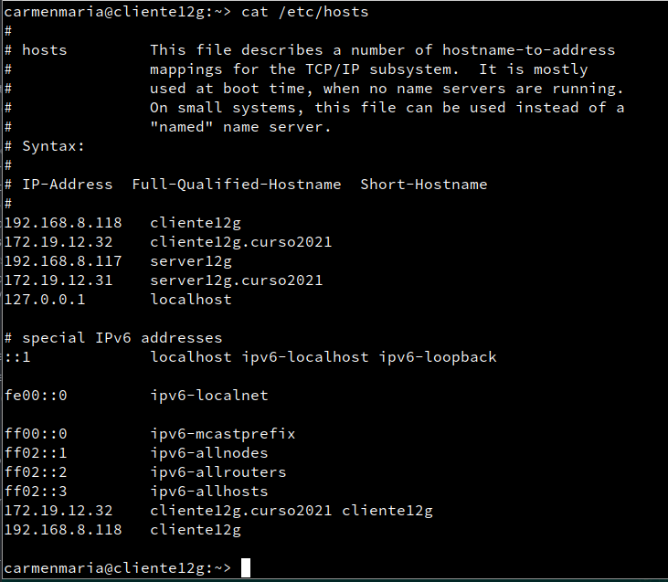

##**3.1 Cliente GNU/Linux GUI**

- Desde en entorno gráfico, podemos comprobar el acceso a recursos compartidos SMB/CIFS.

Algunas herramientas para acceder a recursos Samba por entorno gráfico:

 -Yast en OpenSUSE,

 -Nautilus en GNOME,

-Konqueror en KDE,

  -En Ubuntu podemos ir a "Lugares -> Conectar con el servidor...",

  -También podemos instalar "smb4k".

Ejemplo accediendo al recurso prueba del servidor Samba, pulsamos CTRL+L y escribimos smb://IP-SERVIDOR-SAMBA:

>NOTA: Tube que usar la Ip del server, de mi casa.
**smb://192.168.8.117**

En el momento de autenticarse para acceder al recurso remoto, poner en Dominio el nombre-netbios-del-servidor-samba.

Capturar imagen de lo siguiente:

•	Probar a crear carpetas/archivos en **castillo**

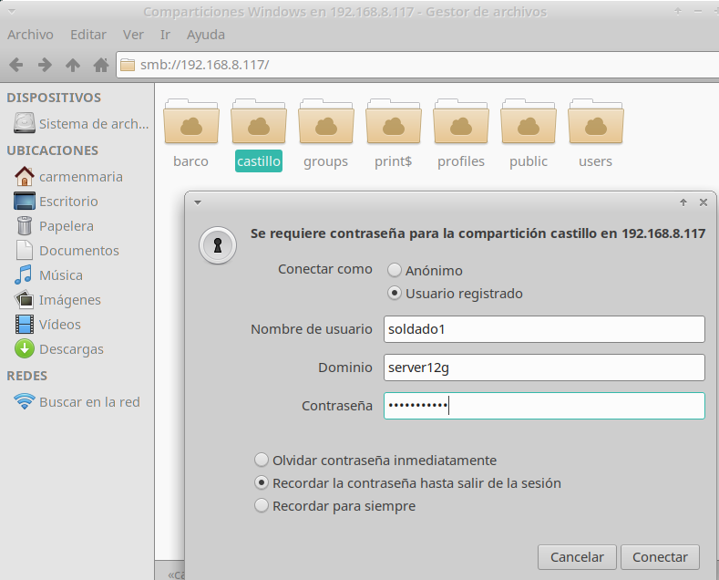

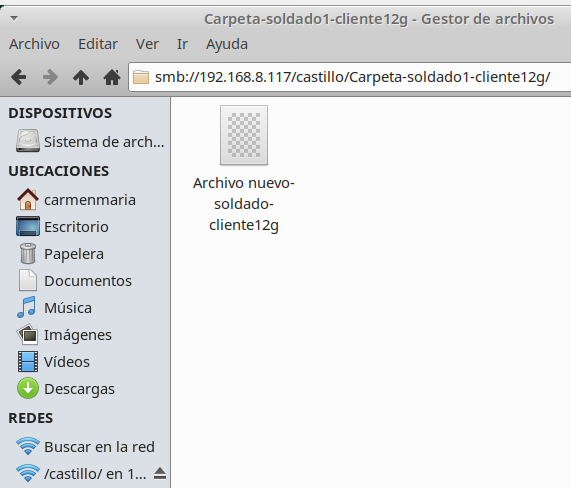

y en **barco**:

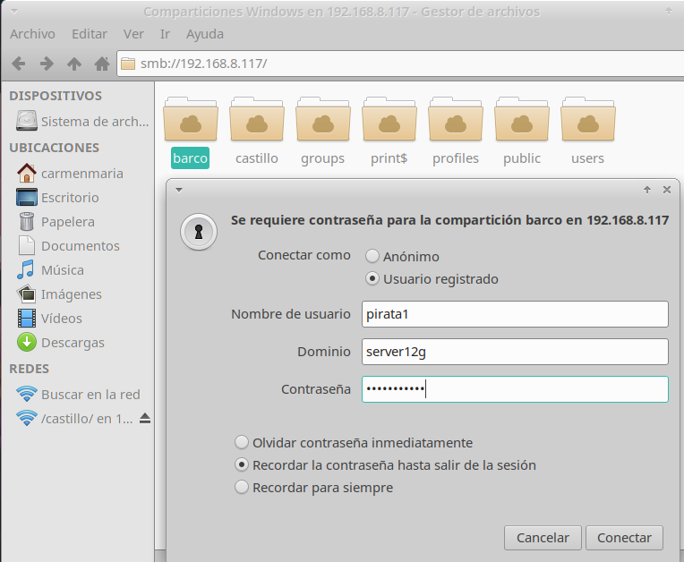

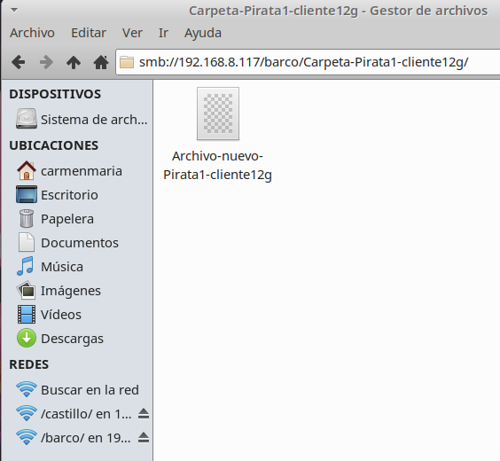

•	Comprobar que el recurso **public** es de sólo lectura.

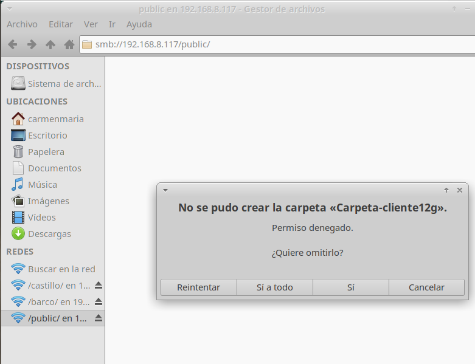

•	Capturar imagen de los siguientes comandos para comprobar los resultados:

o	**smbstatus**, desde el servidor Samba.

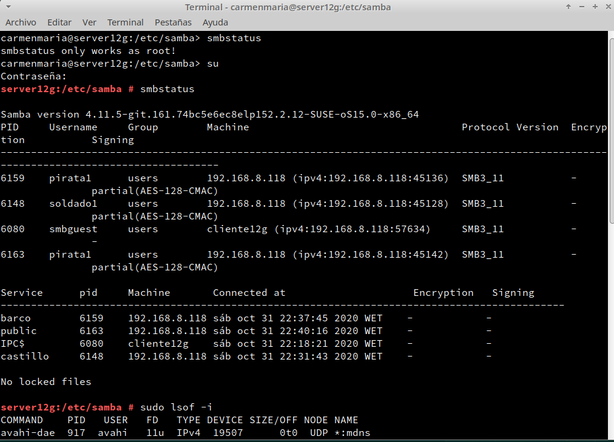

o	**sudo lsof -i**, desde el servidor Samba.

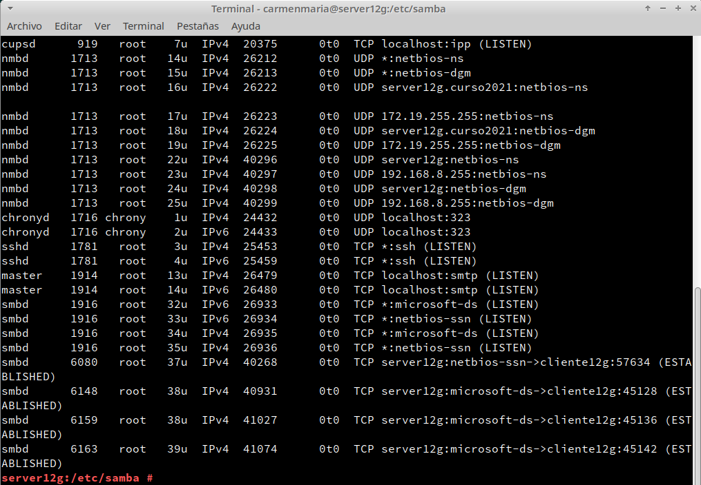

##**3.2 Cliente GNU/Linux comandos**

Capturar imagenes de todo el proceso.

Existen comandos (**smbclient, mount , smbmount**, etc.) para ayudarnos a acceder vía comandos al servidor Samba desde el cliente. Puede ser que con las nuevas actualizaciones y cambios de las distribuciones alguno haya cambiado de nombre. ¡Ya lo veremos!

•	Vamos a un equipo GNU/Linux que será nuestro cliente Samba. Desde este equipo usaremos comandos para acceder a la carpeta compartida.

•	Probar desde una máquina Ubuntu **sudo smbtree** (REVISAR: no muestra nada)

o	Esto muestra todos los equipos/recursos de la red SMB/CIFS.

o	Hay que parar el cortafuegos para que funcione (**systemctl stop firewalld**), o bien

o	ejecutar comando desde la máquina real.

•	Probar desde OpenSUSE: smbclient --list IP-SERVIDOR-SAMBA, Muestra los recursos SMB/CIFS de un equipo.

**smbclient --list 192.168.8.117**

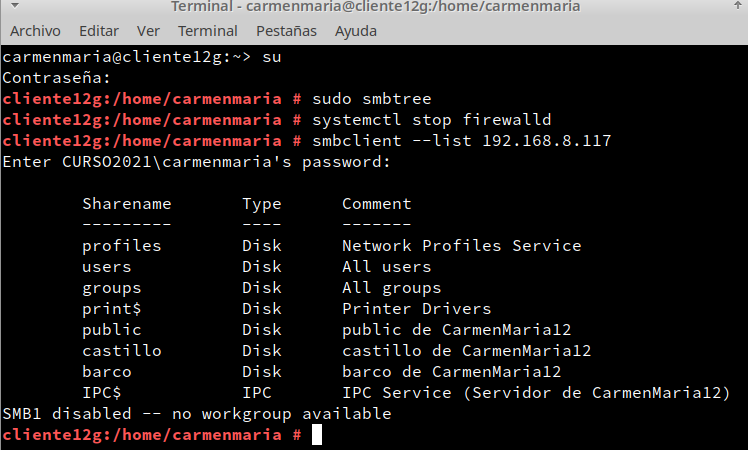

•	Ahora crearemos en local la carpeta /mnt/remotoXX/castillo.

**mkdir -p /mnt/remoto12/castillo**

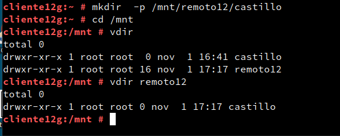

•	MONTAJE MANUAL: Con el usuario root, usamos el siguiente comando para montar un recurso compartido de Samba Server, como si fuera una carpeta más de nuestro sistema: mount -t cifs //172.AA.XX.31/castillo /mnt/remotoXX/castillo -o username=soldado1

**mount -t cifs //192.168.8.117/castillo /mnt/remoto12/castillo -o username=soldado1**

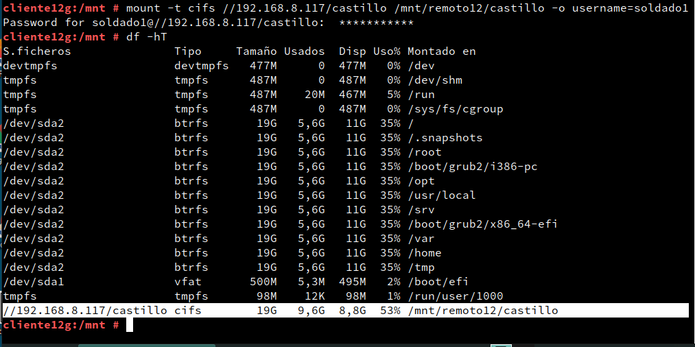

En versiones anteriores de GNU/Linux se usaba el comando: smbmount //172.AA.XX.31/public /mnt/remotoXX/public/ -o -username=sambaguest.

•	**df -hT**, para comprobar que el recurso ha sido montado.

•	Si montamos la carpeta de castillo, lo que escribamos en /mnt/remotoXX/castillo debe aparecer en la máquina del servidor Samba. ¡Comprobarlo!

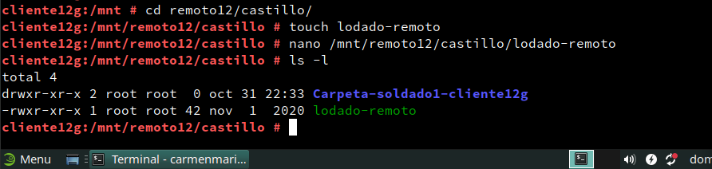

•	Para desmontar el recurso remoto usamos el comando umount.
•	Capturar imagen de los siguientes comandos para comprobar los resultados:
o	smbstatus, desde el servidor Samba.
o	sudo lsof -i, desde el servidor Samba.

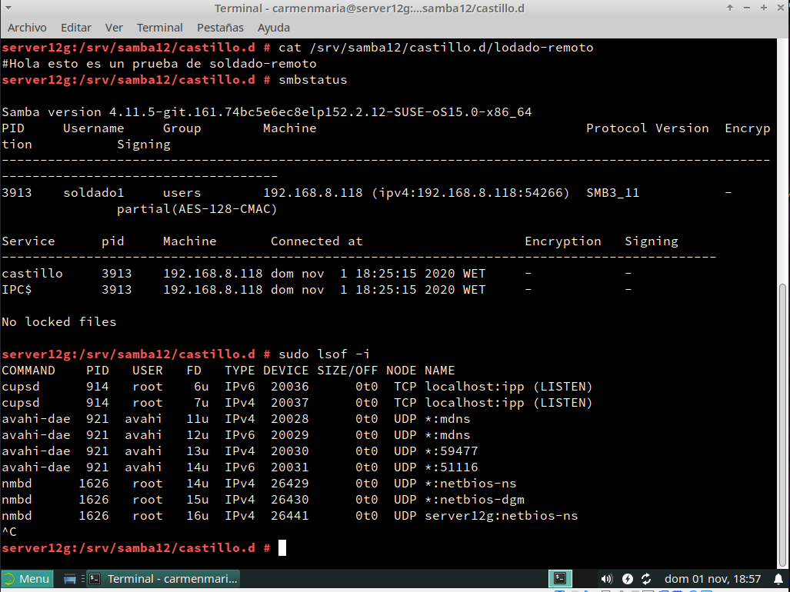

##**3.3 Montaje automático**

•	Hacer una instantánea de la MV antes de seguir. Por seguridad.

•	Capturar imágenes del proceso.

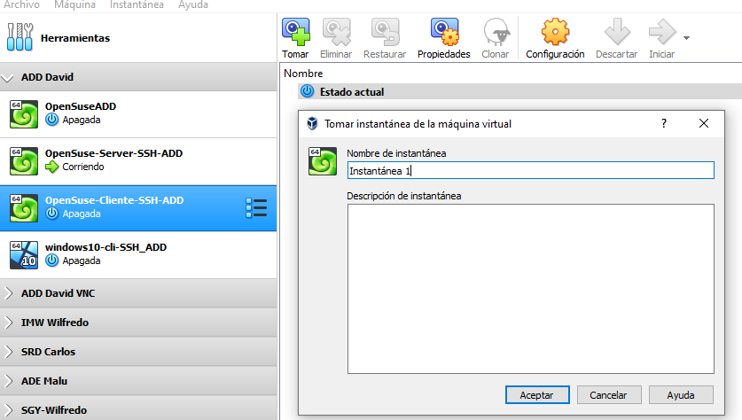

•	Reiniciar la MV.

•	**df -hT**. Los recursos ya NO están montados.

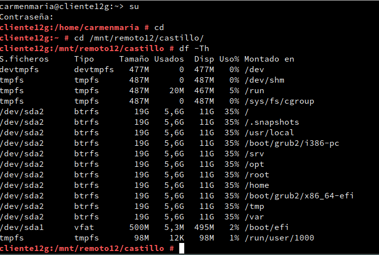

El montaje anterior fue temporal.

Antes accedimos a los recursos remotos, realizando un montaje de forma manual (comandos mount/umount). Si reiniciamos el equipo cliente, podremos ver que los montajes realizados de forma manual ya no están. Si queremos volver a acceder a los recursos remotos debemos repetir el proceso de montaje manual, a no ser que hagamos una configuración de montaje permanente o automática.

•	Para configurar acciones de montaje automáticos cada vez que se inicie el equipo, debemos configurar el fichero **/etc/fstab**. Veamos un ejemplo:

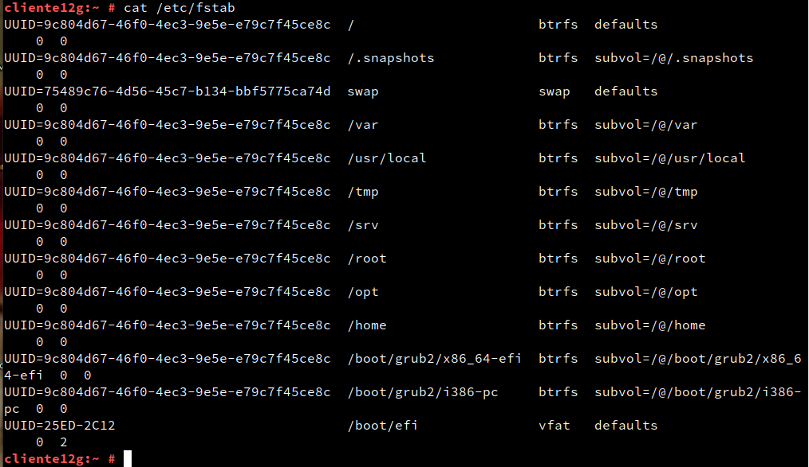

o	**//IP-servidor-samba/public /mnt/remotoXX/public cifs**

 **username=soldado1,password=clave 0 0**
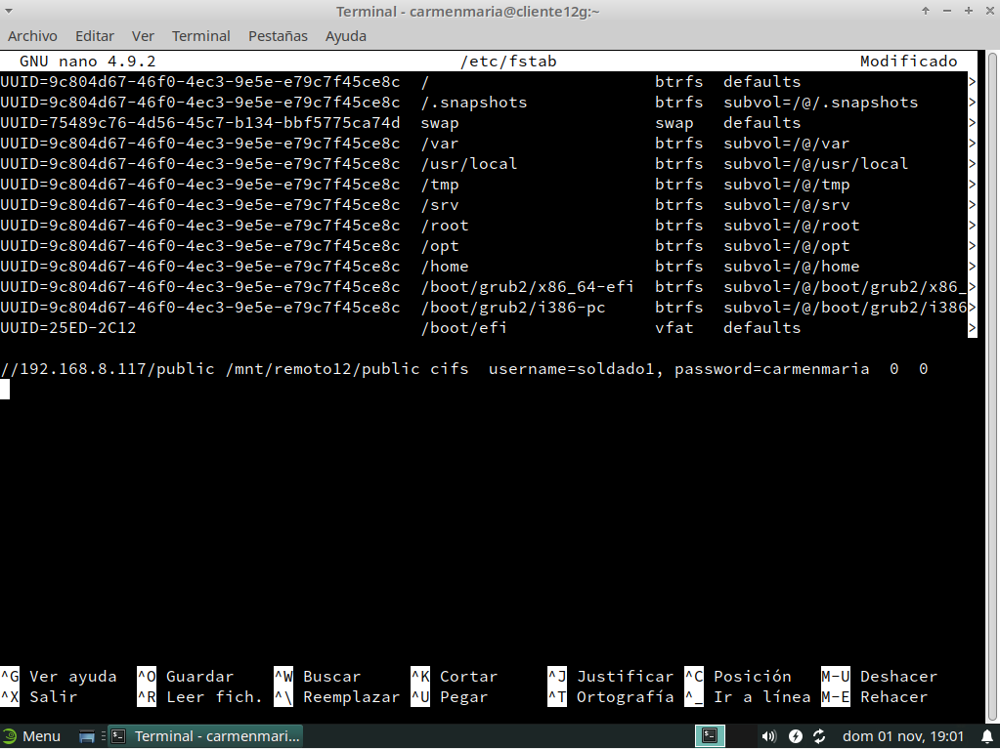
•	Reiniciar el equipo y comprobar que se realiza el montaje automático al inicio.

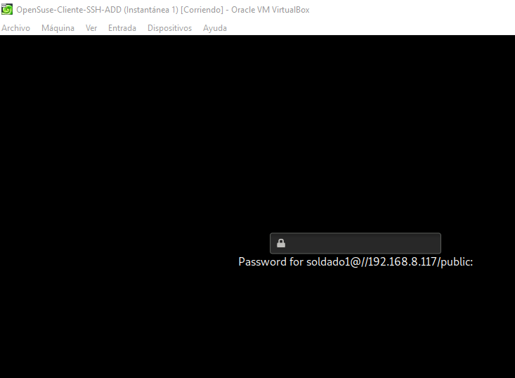

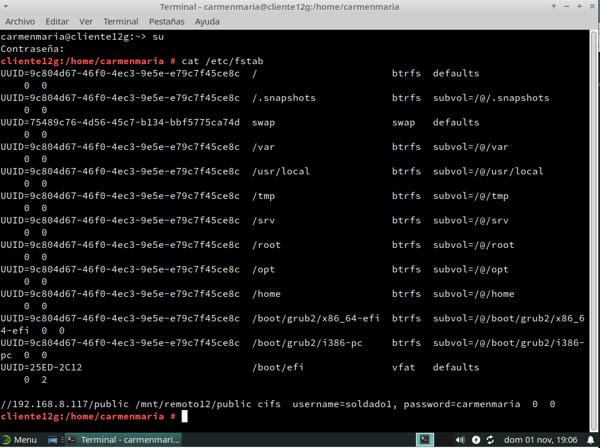

•	Incluir contenido del fichero /etc/fstab en la entrega.

#**4. Preguntas para resolver**

**Servicio y programas:**

    ¿Por qué tenemos dos servicios (smb y nmb) para Samba?

     El servicio de SAMBA funciona con dos programas, de nombres smbd  y  nmbd.

     El programa  **/usr/sbin/smbd**  ofrece los servicios de acceso remoto aficheros e impresoras y se encarga de autenticar y autorizar a los usuarios y  utiliza los puertos 139 TCP(netbios-ssn) y 445 TCP (microsoft-ds) para compartir los archivos2

      Por su parte,el programa **/usr/sbin/nmbd** realiza el anuncio del ordenador en el grupo de trabajo, lagestión de la lista de ordenadores de un grupo, etc., con lo que el sistema Linux apareceen la red como cualquier otro sistema Windows y que utiliza para ello los puertos 137 UDP (netbios-ns) y 138UDP (netbios-dgm).

     Adicionalmente, SAMBA posee algunas utilidades como:

      -**smbclient**, que permite conectarse desde Linux a recursos SMB y transferir ficheros,

       -**smbtar**, que permiterealizar copias de los recursos compartidos,

       -**nmblookup**, que permite realizar búsquedas de nombres NetBIOS,

        -**smbpasswd**, que maneja las claves encriptadas utilizadas por SAMBA,

         -**smbstatus**, que informa de las conexiones de red existentes en los recursos compartidos por el servidor y

          -**testparm**, que valida el fichero de configuración de SAMBA.

**Usuarios:**

    ¿Las claves de los usuarios en GNU/Linux deben ser las mismas que las que usa Samba?

    El requisito que debe de tener el modo de seguridad **“user”** es que debe existir el usuario en el servidor samba y en Linux, para poder acceder a los recursos, es decir, debemos sincronizar la cuentas que existen en Linux y Samba, de forma que si el usuario se llama **“mary”** con la contraseña **“123456789b”**, debe existir también en el servidor Samba. Para hacer esto usamos el comando **pdbedit**

    ¿Puedo definir un usuario en Samba llamado soldado3, y que no exista como usuario del sistema? No

    ¿Cómo podemos hacer que los usuarios soldado1 y soldado2 no puedan acceder al sistema pero sí al samba? (Consultar /etc/passwd)

     Podemos crear un usuario en el sistema sólo y exclusivamente para usar en el servidor Samba, de forma que nadie podrá saber tu usuario ni contraseña que usas normalmente:

     **useradd -s /sbin/nologin usuario-samba** #Creamos el usuario en Linux.

     **passwd usuario-samba** #Añadimos una contraseña de acceso. Esto puede ser opcional, no tenemos porqué darle una contraseña si no queremos, pero un poco de seguridad nunca viene mal.

     **pdbedit -a -u usuario-samba** #Creamos el usuario en el servidor Samba y nos pedirá la contraseña de acceso, que deberá ser la misma que el usuario de Linux.

**Recursos compartidos:**

    Añadir el recurso [homes] al fichero smb.conf según los apuntes. ¿Qué efecto tiene?

    La sección  [homes]  define un recurso de red para cada usuario conocido por SAMBA y lo asocia al directorio raíz de cada usuario del ordenador servidor de SAMBA. Esta sección funciona como opción por defecto, pues un servidor SAMBA intenta primero comprobar si existe un servicio con ese nombre. Si no se encuentra, la solicitud se trata como un nombre de usuario y se busca en el fichero localde contraseñas. Si el nombre existe y la clave es correcta, se crea un servicio, cuyo nombre se cambia de [homes] al nombre local del usuario y, si no se especifica otro valor, se utiliza el directorio raíz del usuario.
