# Servicio de Directorio con comandos  LDAP

Hay varias herramientas que implementan el servidor de directorios LDAP (389-DS, OpenLDAP, Active Directory, etc)

En esta guía vamos a instalar y configurar del servidor LDAP con 389-DS.

# 1. Prerequisitos

## 1.1 Nombre de equipo FQDN

* Vamos a usar una MV OpenSUSE para montar nuestro servidor LDAP

* Revisar /etc/hostname. Nuestra máquina debe tener un FQDN=serverXXg.curso2021.

**server12g.curso2021**

* Revisar /etc/hosts

127.0.0.2   serverXXg.curso2021   serverXXg

Comprobar salida de: hostname -a, hostname -d y hostname -f.

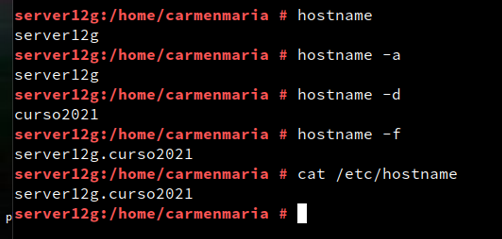

# 2. Instalar el Servidor LDAP

## 2.1 Instalación del paquete

* Abrir una consola como root.

*   zypper in 389-ds, instalar el script de instalación.

*  rpm -qa | grep 389-ds, comprobar que la versión es >= 1.4.*

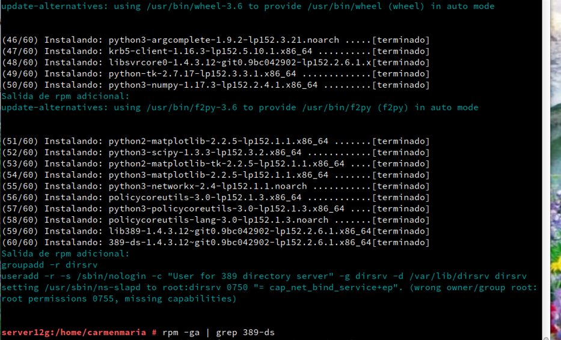

## 2.2 Configurar la instancia

*  Crear el fichero **/root/instance.inf** con el siguiente contenido. Este fichero sirve para configurar el servidor:

#/root/instance.inf

[general]

config_version = 2

[slapd]

root_password =
 YOUR_ADMIN_PASSWORD_HERE

[backend-userroot]

sample_entries = yes

suffix = dc=ldapXX,dc=curso2021

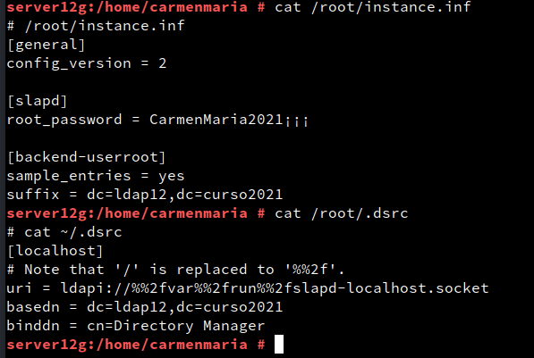

*  dscreate from-file /root/instance.inf, creamos una nueva instancia.

* dsctl localhost status, comprobar el estado actual de la instancia de la base de datos LDAP

>Nota: Si queremos eliminar una instancia de LDAP que ya tenemos creada:

* dsctl localhost stop, para parar la instancia.

* dsctl localhost remove --do-it,para eliminar la instancia.

>NOTA: no me permitía hacer la consulta y parando, borrando y volviendo a crear la instancia me funcionó. Me daba invalid credentials (49) cada ves que utilizaba el comando ldapsearch.

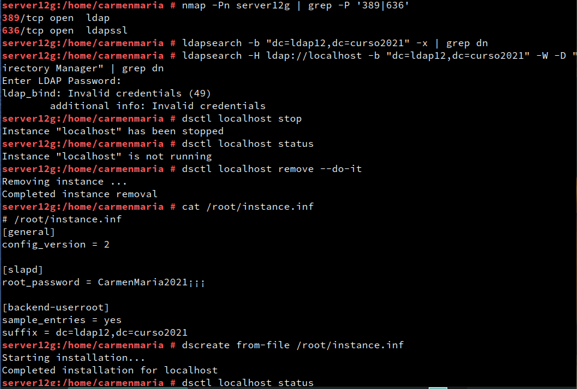

* Creamos el fichero **/root/.dsrc** con el siguiente contenido. Este fichero sirve para configurar los permisos para acceder a la base de datos como administrador:

 **ldap12** donde esta ldapXX

#cat ~/.dsrc

[localhost]

#Note that '/' is replaced to '%%2f'.

uri = ldapi://%%2fvar%%2frun%%2fslapd-localhost.socket

basedn = dc=ldapXX,dc=curso2021

binddn = cn=Directory Manager

## 2.3 Comprobamos el servicio

*  systemctl status dirsrv@localhost, comprobar si el servicio está en ejecución.

*  nmap -Pn serverXX | grep -P '389|636', para comprobar que el servidor LDAP es accesible desde la red. En caso contrario, comprobar cortafuegos.

**server12g** donde esta serverXX

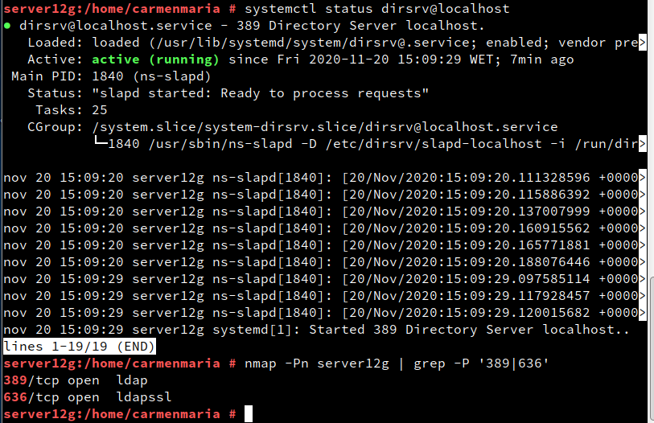

## 2.4 Comprobamos el acceso al contenido del LDAP

*  ldapsearch -b "dc=ldapXX,dc=curso2021" -x | grep dn, muestra el contenido de nuestra base de datos LDAP. "dn" significa nombre distiguido, es un identificador que tiene cada nodo dentro del árbol LDAP.

*  ldapsearch -H ldap://localhost -b "dc=ldapXX,dc=curso2021" -W -D "cn=Directory Manager" | grep dn, en este caso hacemos la consulta usando usuario/clave.

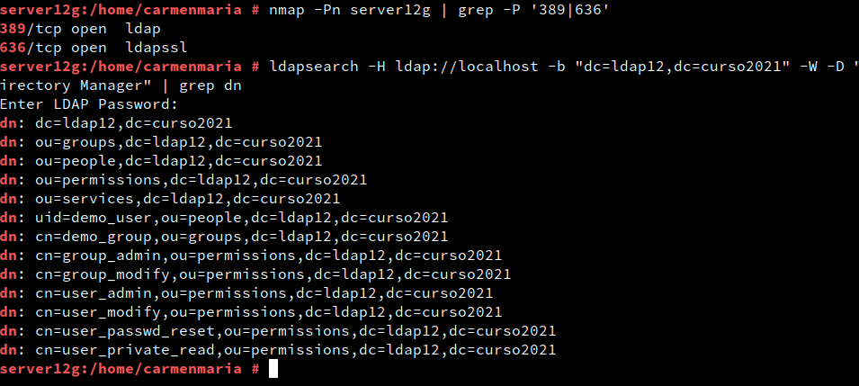

# 3. Añadir usuarios LDAP por comandos

## 3.1 Buscar Unidades Organizativas

Deberían estar creadas las OU People y Groups, es caso contrario hay que crearlas (Consultar ANEXO). Ejemplo para buscar las OU:

ldapsearch -H ldap://localhost:389
           -W -D "cn=Directory Manager"
           -b "dc=ldapXX,dc=curso2021" "(ou=*)" | grep dn

* Importante: No olvidar especificar la base (-b). De lo contrario probablemente no haya resultados en la búsqueda.

    * "(ou=*)" es un filtro de búsqueda de todas las unidades organizativas.

    * "(uid=*)" es un filtro de búsqueda de todos los usuarios.

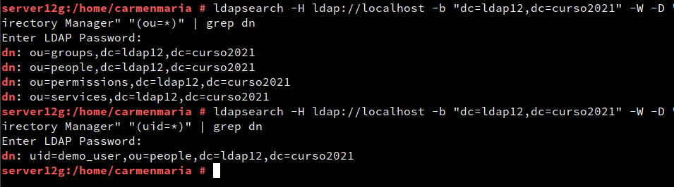

## 3.2 Agregar usuarios

Uno de los usos más frecuentes para el directorio LDAP es para la administración de usuarios.

*  Vamos a utilizar ficheros ldif para agregar usuarios.

* Crear Fichero **mazinger-add.ldif** con la información para crear el usuario mazinger (Cambiar el valor de dn por el nuestro):

dn: uid=mazinger,ou=people,dc=ldapXX,dc=curso2021

uid: mazinger

cn: Mazinger Z

objectClass: account

objectClass: posixAccount

objectClass: top

objectClass: shadowAccount

userPassword: {CLEARTEXT}escribir la clave secreta

shadowLastChange: 14001

shadowMax: 99999

shadowWarning: 7

loginShell: /bin/bash

uidNumber: 2001

gidNumber: 100

homeDirectory: /home/mazinger

gecos: Mazinger Z

    WARNING: Los valores de cada parámetro no deben tener espacios extra al final de la línea, porque provoca un error de sintáxis.

  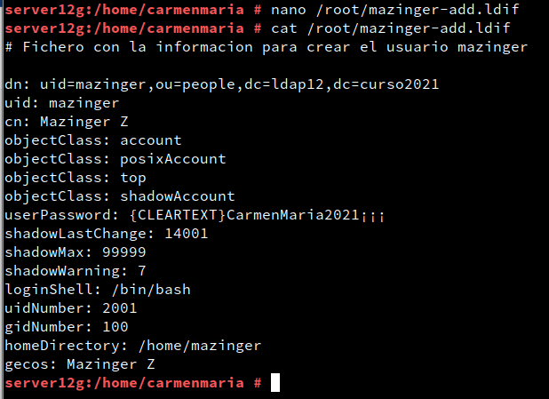

  

  >Nota: habia creado los ficheros  grupos antes de poder solucionar el ldapsearch. Sale creados directamente sin yo  poder ingresar los datos en ldif.No era necesario crearlos.

*  **ldapadd -x -W -D "cn=Directory Manager" -f mazinger-add.ldif**, escribir los datos del fichero ldif anterior en LDAP.

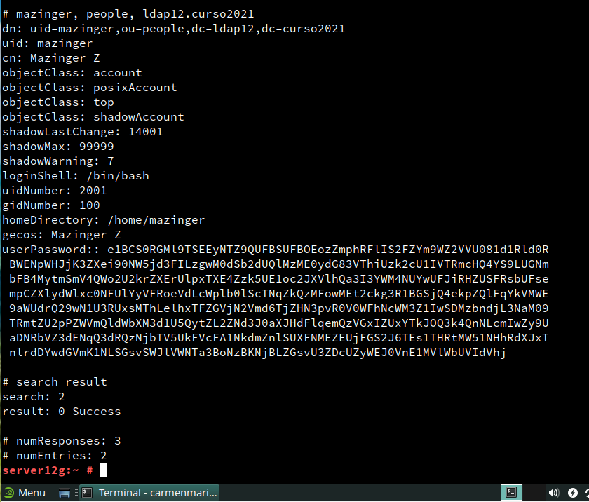

* Eliminar usuario del árbol del directorio

    * Crear un archivo **mazinger-delete.ldif**

    dn: uid=mazinger,ou=people,dc=ldapXX,dc=curso2021
    changetype: delete

    *  Ejecutamos el siguiente comando para eliminar un usuario del árbol LDAP:

    ldapmodify -x -D "cn=Directory Manager" -W -f mazinger-delete.ldif

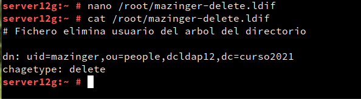

# 4. Contraseñas encriptadas

En el ejemplo anterior la clave se puso en texto plano. Cualquiera puede leerlo y no es seguro. Vamos generar valores de password encriptados.

## 4.1 TEORIA: Herramienta slappasswd

Ejecutar **zypper in openldap2**, para instalar la heramienta **slappasswd** en OpenSUSE.

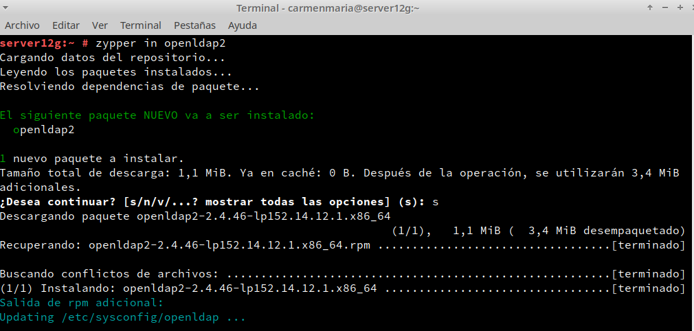

*  Ejecutar zypper in openldap2, para instalar la heramienta slappasswd en OpenSUSE.

La herramienta slappasswd provee la funcionalidad para generar un valor userPassword adecuado. Con la opción -h es posible elegir uno de los siguientes esquemas para almacenar la contraseña:

    {CLEARTEXT} (texto plano),
    {CRYPT} (crypt),
    {MD5} (md5sum),
    {SMD5} (MD5 con salt),
    {SHA} (1ssl sha) y
    {SSHA} (SHA-1 con salt, esquema por defecto).

  * Ejemplo SHA-1

    Para generar un valor de contraseña hasheada utilizando SHA-1 con salt compatible con el formato requerido para un valor userPassword, ejecutar el siguiente comando:

    **slappasswd -h {SSHA}**

    $ slappasswd
    New password:
    Re-enter new password:
    {SSHA}5uUxSgD1ssGkEUmQTBEtcqm+I1Aqsp37    

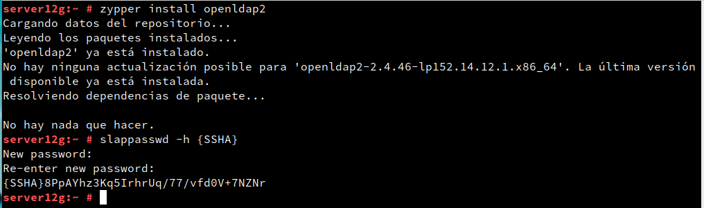

## /etc/shadow

Identificar el sistema de encriptación de contraseñas utilizado por GNU/Linux.

*  Consultando nuestro fichero /etc/shadow podemos ver que las contraseñas tienen el esquema $6$aaa$bbbb.

*  Por tanto, se deduce que:

        $6$ => estamos usando SHA-512 (86 Caracteres) para encriptar.
        aaa => salt bit
        bbb => clave encriptada.

## 4.2 Agregar más usuarios con clave encriptada

|Full name |	Login acount |	uid |
	Clave encriptada SHA|

| -- | -- | -- | -- |

|Koji Kabuto |	koji |	2002 |	Contraseña encriptada|

|Boss |	boss |	2003 |	Contraseña encriptada|

|Doctor Infierno |	drinfierno |	2004 |	Contraseña encriptada|

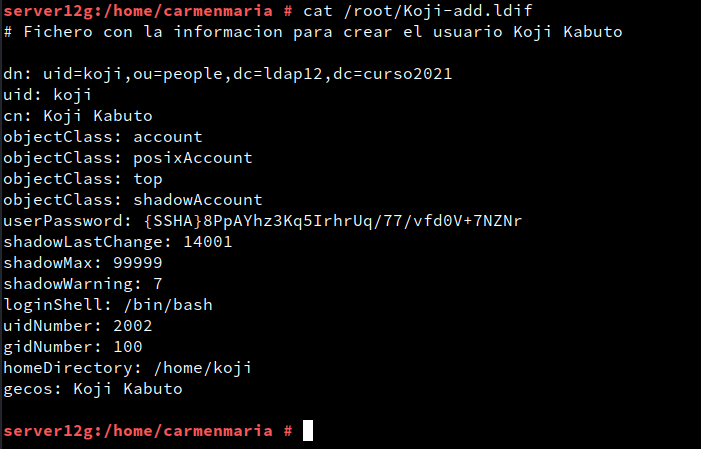

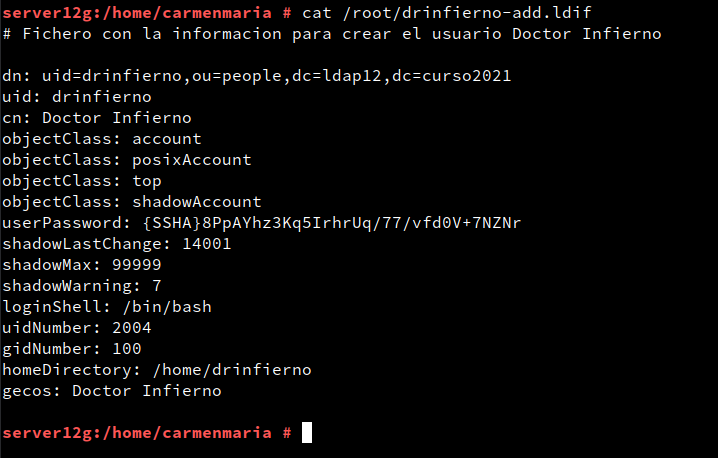

* ldapadd -x -W -D "cn=Directory Manager" -f mazinger-add.ldif , escribir los datos de los fichero ldif anterior en LDAP cambiando el nombre de cada uno.

    * Koji-add.ldif

    * boss-add.ldif

    * drinfierno-add.ldif

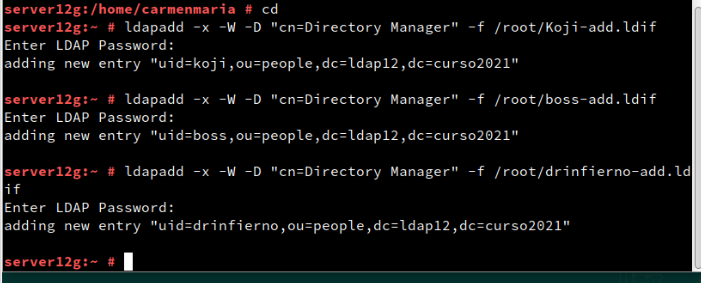

## 4.3 Comprobar los usuarios creados

*  Ir a la MV cliente LDAP.

*  nmap -Pn IP-LDAP-SERVER, **nmap -Pn 172.19.12.31**

 comprobar que el puerto LDAP del servidor está abierto. Si no aparecen los puertos abiertos, entonces revisar el cortafuegos.

 >Nota: servicio de red en adaptador puente

 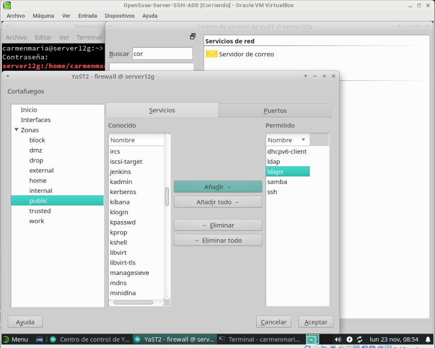

*  ldapsearch -H ldap://IP-LDAP-SERVER -W -D "cn=Directory Manager" -b "dc=ldapXX,dc=curso2021" "(uid=*)" | grep dn para consultar los usuarios LDAP que tenemos en el servicio de directorio remoto.

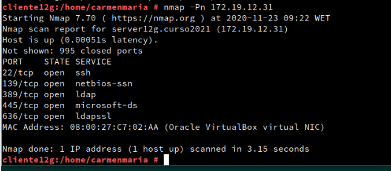

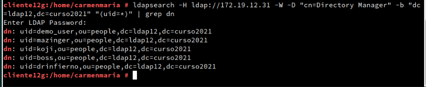
