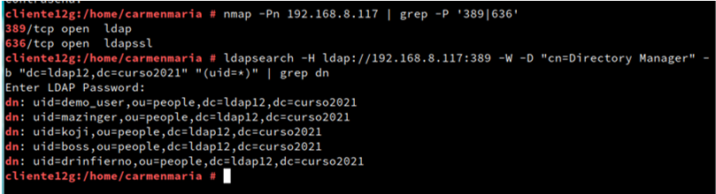
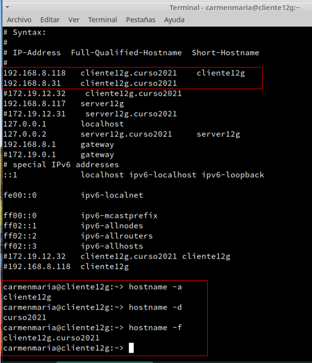
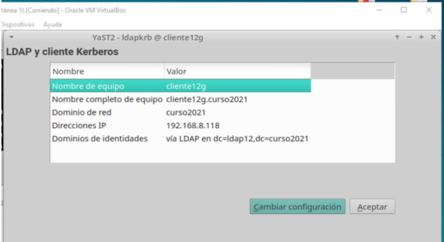
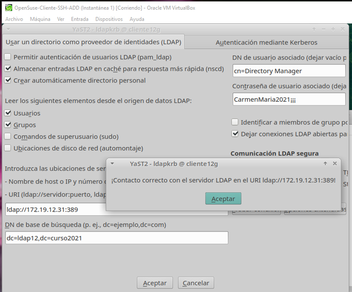
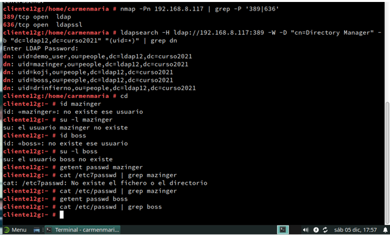

# Autenticación LDAP

## Cliente para autenticación LDAP

Se pretende utilizar la máquina de servidor LDAP, como repositorio centralizado de la información de grupos, usuarios, claves, etc.
Se intentará acceder desde una máquina remota con LDAP,  usando los usuarios ya definidos en el servidor LDAP.

En esta actividad, vamos a configurar otra MV (GNU/Linux OpenSUSE) para que podamos hacer autenticación en ella, pero usando los usuarios y grupos definidos en el servidor de directorios LDAP de la MV1.

**Descipción:**
Configurar autenticación a travès del servicio de directorio **389-DS**

**Requisitos:**
Partimos de 389-DS en OpenSUSE

## 1. Preparativos

* Damos por hecho de que ya tenemos una **MV1 (sever12g)** con DS_389 instalado, y con varios usuarios creados dentro del DS, y comprobada la conexión con una MV remota.

IP de clase: 172.19.12.32

IP de casa: 192.168.8.117

* Necesitamos MV2 con SO OpenSUSE

IP de clase: 172.19.12.31

IP de casa: 192.168.8.118

* Comprobamos el acceso al LDAP desde la **MV2 (cliente12g)** que hemos configurado, previamente.

## 1.2- Ir a MV cliente.

Desde la consola lanzamos los siguientes comandos:

•	nmap -Pn IP-LDAP-SERVERXX | grep -P '389|636',

**nmap -Pn 192.168.8.117 | grep -P '389|636'**
 para comprobar que el servidor LDAP es accesible desde la MV2 cliente.

•	ldapsearch -H ldap://IP-LDAP-SERVERXX:389 -W -D "cn=Directory Manager" -b "dc=ldapXX,dc=curso2021" "(uid=*)" | grep dn,

**ldapsearch -H ldap://192.168.8.117-:389 -W -D "cn=Directory Manager" -b "dc=ldap12,dc=curso2021" "(uid=*)" | grep dn**
comprobamos que los usuarios del LDAP remoto son visibles en el cliente.

# 2. Configurar autenticación LDAP
## 2.1 Crear conexión con servidor
Vamos a configurar de la conexión del cliente con el servidor LDAP.

•	Ir a la MV cliente.
•	No aseguramos de tener bien el nombre del equipo y nombre de dominio (/etc/hostname, /etc/hosts)

•	Ir a Yast -> Cliente LDAP y Kerberos.

•	Configurar como la imagen de ejemplo:

o	BaseDN: dc=ldapXX,dc=curso2021

o	DN de usuario: cn=Directory Manager

o	Contraseña: CLAVE del usuario cn=Directory Manager

•	Al final usar la opción de Probar conexión

Esta es desde casa:

Esta es desde clase:

## 2.2 Comprobar con comandos

•	Vamos a la consola con usuario root, y probamos lo siguiente:

* id mazinger

* su -l mazinger   # Entramos con el usuario definido en LDAP

* getent passwd mazinger          # Comprobamos los datos del usuario

* cat /etc/passwd | grep mazinger # El usuario NO es local

>Nota: Al introducir estos comandos me indica que no existen los usuarios.

