# Vagrant con VirtualBox
# 1. Introducción

Vagrant es una herramienta para la creación y configuración de entornos de desarrollo virtualizados.
Vagrant permite administrar y controlar  fácilmente múltiples máquinas virtuales.
Está construido sobre VirtualBox y VMWare, y proporciona muchas capacidades emocionantes:

* Puede crear entornos aislados de desarrollo,
* experimentar con nuevos productos y tecnologías,
* instalar nuevas versiones de paquetes existentes,
* crear tu propio centro de datos privado en tu máquina,
* y ejecutar diferentes sistemas operativos.

Todo esto esta disponible en un sitio fácil de administrar y totalmente seguro, que no puede interferir con tus actividades principales y sistema operativo.

### Conclusión
Vagrant te da una computadora fácil de usar dentro de otra computadora. Puedes administrar varias MVs para diversos propósitos, y el **Vagranfile** es tu interfaz para especificar como se debería comportar la MV.

# 2. Instalar Vagrant

La instalación se hará en una MR. En mi caso con S.O. Windows 10

•	Instalar Vagrant.
Abrir un navegador en la MR: **descargar vagrant versión 2.2.14**  pues es compatible con el virtualbox instalado.

>Nota:
En MR linux:
sudo apt-get install virtualbox dkms,
sudo apt-get -y install vagrant

•	Si vamos a trabajar Vagrant con MV de VirtualBox, hay que comprobar que las versiones de ambos son compatibles entre sí.

* vagrant version, para comprobar la versión actual de Vagrant.

*	VBoxManage -v, para comprobar la versión actual de VirtualBox.

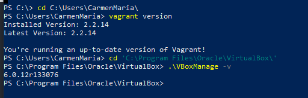

# 3. Proyecto Celtics
## 3.1 Imagen,caja o box
BOXNAME= nombre de la caja

OJO: Sustituir BOXNAME por ubuntu/bionic64

•	vagrant box add BOXNAME, **vagrant box add ubuntu/bionic64** , descargar la caja que necesitamos a través de vagrant.

•	**vagrant box list** , lista las cajas/imágenes disponibles actualmente en nuestra máquina.

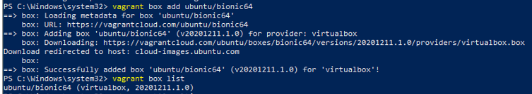

## 3.2 Directorio
•	Crear un directorio para nuestro proyecto. Donde XX es el número de cada alumno:

mkdir vagrantXX-celtics  

**mkdir vagrant12-celtics**

cd vagrantXX-celtics

**cd vagrant12-celtics**

A partir de ahora vamos a trabajar dentro de esta carpeta.
>NOTA: Tuve que crearla en c:\users\carmenmaria porque en c:\Windows\system32 no me permitía crear ficheros.

•	Crear el fichero **Vagrantfile** de la siguiente forma:

Vagrant.configure("2") do |config|
  config.vm.box = "BOXNAME"
  config.vm.hostname = "nombre-alumnoXX-celtics"
  config.vm.provider "virtualbox"
end

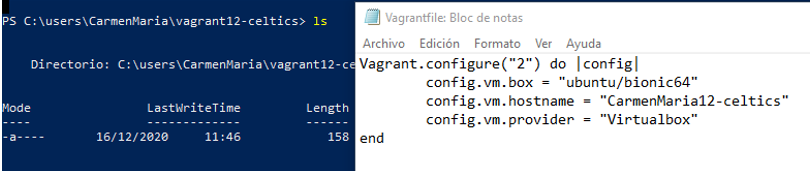

## 3.3 Comprobar
Vamos a crear una MV nueva y la vamos a iniciar usando Vagrant:

•	Debemos estar dentro de vagrantXX-celtics.

•	**vagrant up**, para iniciar una nueva instancia de la máquina.

Vagrant por defecto instalará la MV sin entorno gráfico.  

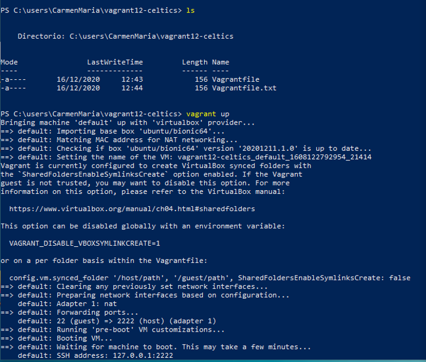

•	**vagrant ssh**: Conectar/entrar en nuestra máquina virtual usando SSH.

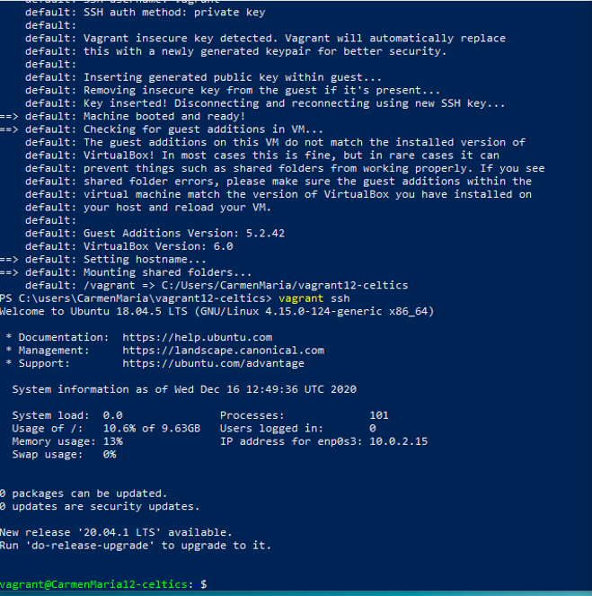
**Otros comandos últiles de Vagrant son:**
•	**vagrant suspend**: Suspender la máquina virtual. Tener en cuenta que la MV en modo suspendido consume más espacio en disco debido a que el estado de la máquina virtual que suele almacenarse en la RAM se pasa a disco.

•	**vagrant resume** : Volver a despertar la máquina virtual.

•	**vagrant halt**: Apagarla la máquina virtual.

•	**vagrant status**: Estado actual de la máquina virtual.

•	**vagrant destroy**: Para eliminar la máquina virtual (No los ficheros de configuración).

# 4. Teoría
**Carpetas compartidas**

La carpeta del proyecto que contiene el **Vagrantfile** es visible para el sistema el virtualizado, esto nos permite compartir archivos fácilmente entre los dos entornos.

Ejemplos para configurar las carpetas compartidas:

•	config.vm.synced_folder ".", "/vagrant": La carpeta del proyecto es accesible desde /vagrant de la MV.

•	config.vm.synced_folder "html", "/var/www/html". La carpeta htdocs del proyecto es accesible desde /var/www/html de la MV.

**Redireccionamiento de los puertos**

Cuando trabajamos con máquinas virtuales, es frecuente usarlas para proyectos enfocados a la web, y para acceder a las páginas es necesario configurar el enrutamiento de puertos.

•	config.vm.network "private_network", ip: "192.168.33.10": Ejemplo para configurar la red.

Conexión SSH: Ejemplo para personalizar la conexión SSH a nuestra máquina virtual:

config.ssh.username = 'root'

config.ssh.password = 'vagrant'

config.ssh.insert_key = 'true'

Ejemplo para configurar la ejecución remota de aplicaciones gráficas instaladas en la máquina virtual, mediante SSH:

config.ssh.forward_agent = true

config.ssh.forward_x11 = true

>NOTA: ¿Cómo podríamos crear una MV Windows usando vagrant en GNU/Linux?
Si estoy en MR Windows usando vagrant y eh creado una MV GNU/Linux, creo que usando el mismo procedimiento solo que en lugar de poner ubuntus/bionic64 pondré la imagen:..ejemplo:. windows/precise32..

# 5. Proyecto Hawks
Ahora vamos a hacer otro proyecto añadiendo redirección de puertos.

## 5.1 Creamos proyecto Hawks
•	Crear carpeta vagrantXX-hawks. Entrar en el directorio.

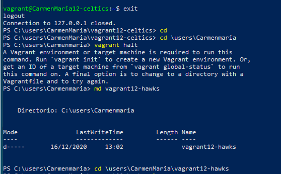

•	Crear proyecto Vagrant.

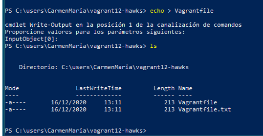
•	Configurar Vagrantfile para usar nuestra caja BOXNAME y hostname = "nombre-alumnoXX-hawks".

•	Modificar el fichero Vagrantfile, de modo que el puerto 4567 del sistema anfitrión sea enrutado al puerto 80 del ambiente virtualizado.

  -	config.vm.network :forwarded_port, host: 4567, guest: 80

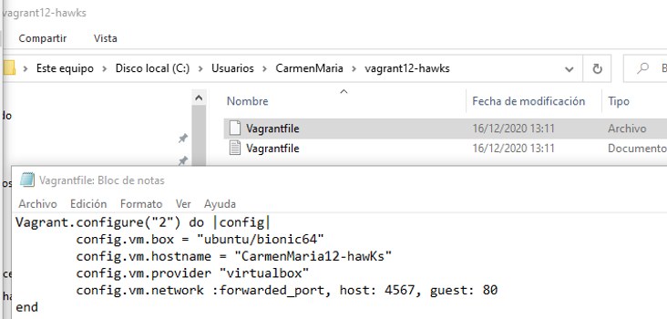
•	vagrant up, iniciamos  la MV

•	vagrant ssh, entramos en la MV de ubuntus, desde terminal windows.

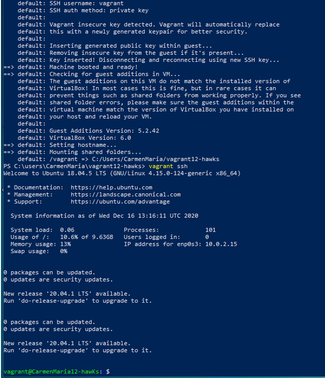

•	Instalamos apache2.

>NOTA: Estamos dentro de la MV de Ubuntus y usaremos los comandos de ubuntus aunque estemos escribiendo en la terminal de power shell de nuestra  MR de Windows. **sudo apt-get install apache2**

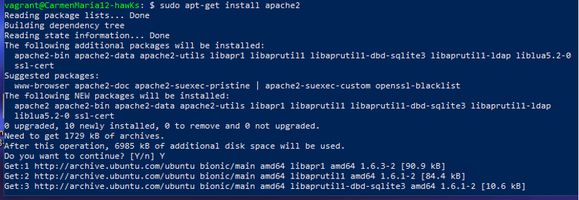

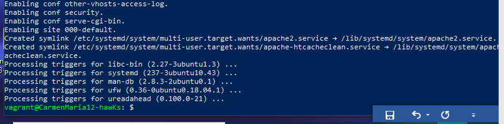

>NOTA: Cuando la MV está iniciada y queremos recargar el fichero de configuración si ha cambiado hacemos vagrant reload.

## 5.2 Comprobar
Para confirmar que hay un servicio a la escucha en 4567, desde la máquina real podemos ejecutar los siguientes comandos:

•	En el HOST-CON-VAGRANT (Máquina real). Comprobaremos que el puerto 4567 está a la escucha.
o	vagrant port para ver la redirección de puertos de la máquina Vagrant.

•	En HOST-CON-VAGRANT, abrimos el navegador web con el URL http://127.0.0.1:4567. En realidad estamos accediendo al puerto 80 de nuestro sistema virtualizado.

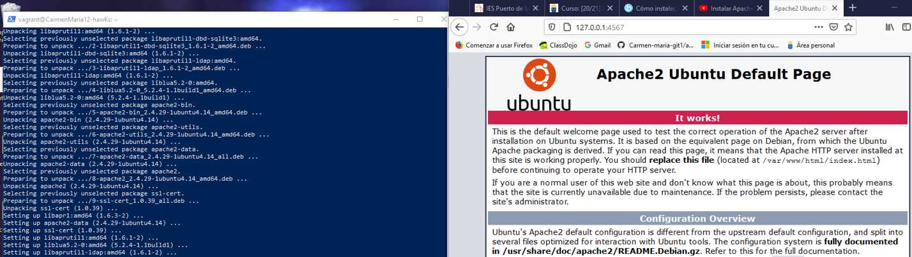

# 6. Suministro
Una de los mejores aspectos de Vagrant es el uso de herramientas de suministro. Esto es, ejecutar "una receta" o una serie de scripts durante el proceso de arranque del entorno virtual para instalar, configurar y personalizar un sin fin de aspectos del SO del sistema anfitrión.

•	vagrant halt, apagamos la MV.

•	vagrant destroy y la destruimos para volver a empezar.

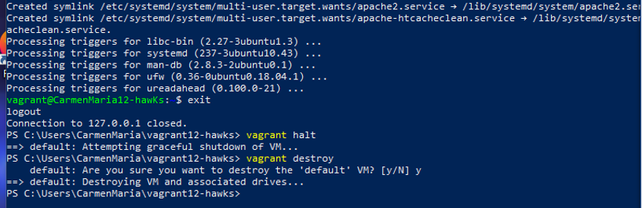

## 6.1 Proyecto Lakers (Suministro mediante shell script)
Ahora vamos a suministrar a la MV un pequeño script para instalar Apache.

•	Crear directorio vagrantXX-lakers **vagrant12-Lakers** para nuestro proyecto.

•	Entrar en dicha carpeta.

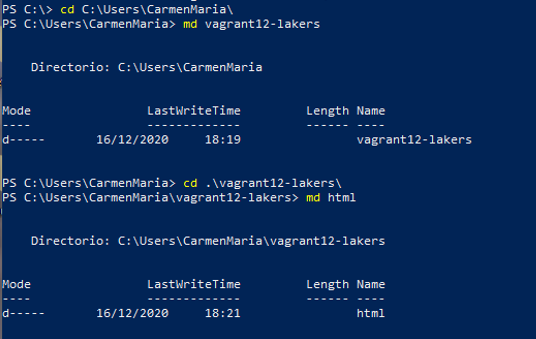

•	Crear la carpeta html y crear fichero **html/index.html** con el siguiente contenido:

h1>Proyecto Lakers</h1>

p>Curso201920

p>Nombre-del-alumno

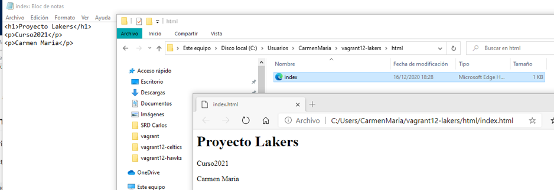

•	Crear el script install_apache.sh, dentro del proyecto con el siguiente contenido:

#!/usr/bin/env bash

apt-get update
apt-get install -y apache2

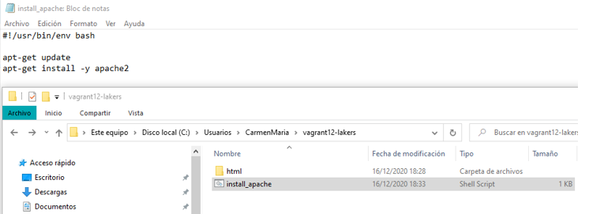

Incluir en el fichero de configuración Vagrantfile lo siguiente:

•	config.vm.hostname = "nombre-alumnoXX-lakers"

•	config.vm.provision :shell, :path => "install_apache.sh", para indicar a Vagrant que debe ejecutar el script install_apache.sh dentro del entorno virtual.

•	config.vm.synced_folder "html", "/var/www/html", para sincronizar la carpeta exterior html con la carpeta interior. De esta forma el fichero "index.html" será visible dentro de la MV.

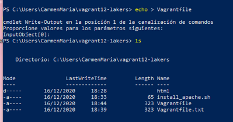

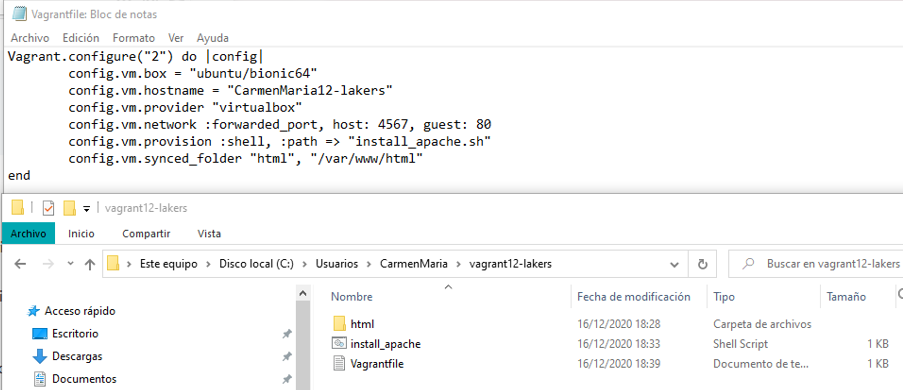

•	vagrant up, para crear la MV.
o	Podremos notar, al iniciar la máquina, que en los mensajes de salida se muestran mensajes que indican cómo se va instalando el paquete de Apache que indicamos.

•	Para verificar que efectivamente el servidor Apache ha sido instalado e iniciado, abrimos navegador en la máquina real con URL http://127.0.0.1:4567.

>NOTA: Podemos usar vagrant reload, si la MV está en ejecución, para que coja los cambios de configuración sin necesidad de reiniciar.

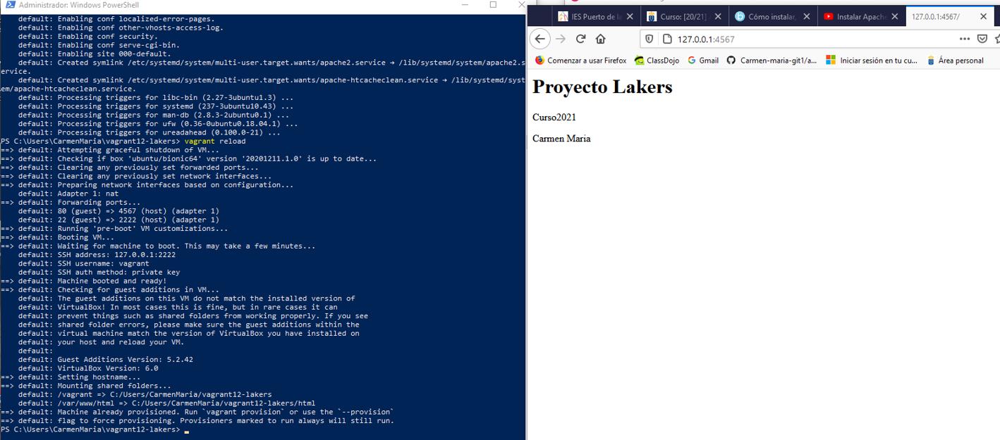

## 6.2 Proyecto Raptors (Suministro mediante Puppet)

Se pide hacer lo siguiente:

•	Crear directorio vagrantXX-raptors **vagrant12-raptors** como nuevo proyecto Vagrant.

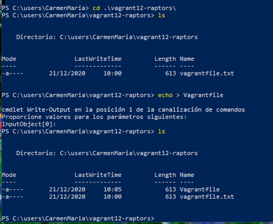

•	Modificar el archivo **Vagrantfile** de la siguiente forma:

Vagrant.configure("2") do |config|
  ...
  config.vm.hostname = "nombre-alumnoXX-raptors"
  ...
  #Nos aseguramos de tener Puppet en la MV antes de usarlo.
  config.vm.provision "shell", inline: "sudo apt-get update && sudo apt-get install -y puppet"

  #Hacemos aprovisionamiento con Puppet
  config.vm.provision "puppet" do |puppet|
    puppet.manifest_file = "nombre-del-alumnoXX.pp"
  end
 end

 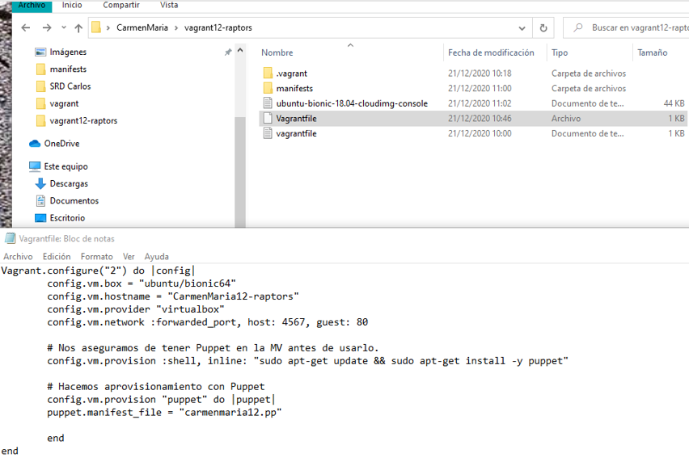

Cuando usamos config.vm.provision "shell", inline: '"echo "Hola"', se ejecuta directamente el comando especificado en la MV. Es lo que llamaremos provisión inline.

•	Ahora hay que crear el fichero manifests/nombre-del-alumnoXX.pp, **manifests/carmenmaria12.pp**  con las órdenes/instrucciones Puppet para instalar un programa determinado (Cambiar PACKAGENAME por el paquete que queramos). Ejemplo: PACKAGENAME=>**geany**

package { 'PACKAGENAME':
  ensure => 'present',
}

>NOTA: los ficheros .pp son ficheros con órdenes de tipo Puppet para suministrar la MV. Estos ficheros se guardan en un directorio "manifests"
 en plural porque puede tener muchos ficheros pp dentro.En esta actividad usaremos la opción puppet.manifest_file ="carmenmaria12.pp"

El Puppet es un gestor de infraestructura que veremos en otra actividad.

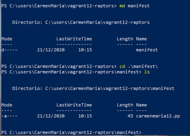

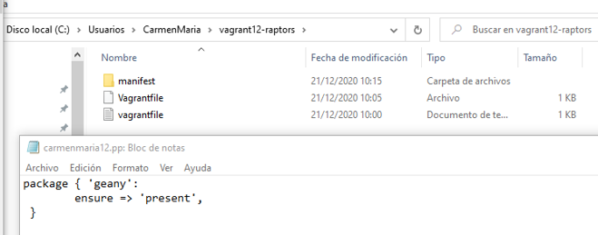

* vagrant up
* vagrant ssh
* Geany es de entorno gráfico y la MV no lo tiene, no se ha instalado, para comprobar que está usamos el comando **whereis geany** o el **zypper search geany**

>NOTA: Un fallo de las extensiones en windows es que por defecto no se ven en entorno gráfico, pero si en la terminal.
Solución:Explorador de archivos-> pestaña vista-> cinta de opciones -> buscar y marcar Extensiones de nombre de archivos->mostrar

Para que se apliquen los cambios de configuración tenemos 2 caminos:

•	Con la MV encendida
1.	vagrant reload, recargar la configuración.
2.	vagrant provision, volver a ejecutar la provisión.

•	Con la MV apagada:
1.	vagrant destroy, destruir la MV.
2.	vagrant up volver a crearla.

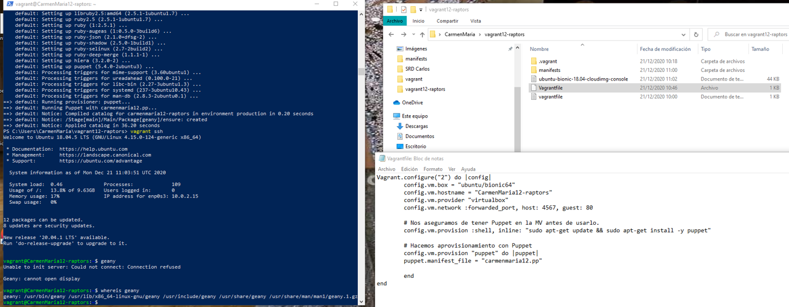

# 7. Proyecto Bulls (Nuestra caja)
En los apartados anteriores hemos descargado una caja/box de un repositorio de Internet, y la hemos personalizado. En este apartado vamos a crear nuestra propia caja/box a partir de una MV de VirtualBox que tengamos.

## 7.1 Preparar la MV VirtualBox

Elegir una máquina virtual

Lo primero que tenemos que hacer es preparar nuestra máquina virtual con una configuración por defecto, por si queremos publicar nuestro Box, ésto se realiza para seguir un estándar y que todo el mundo pueda usar dicho Box.

•	Crear una MV VirtualBox nueva o usar una que ya tengamos.

•	Instalar OpenSSH Server en la MV.

sudo apt-get update

sudo apt-get install openssh-Server

sudo systemctl status sshd.service

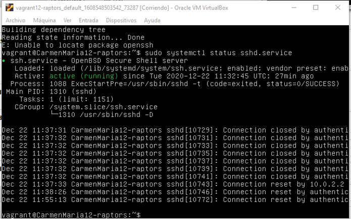

Crear usuario con aceso SSH
Vamos a crear el usuario vagrant. Esto lo hacemos para poder acceder a la máquina virtual por SSH desde fuera con este usuario. Y luego, a este usuario le agregamos una clave pública para autorizar el acceso sin clave desde Vagrant. Veamos cómo:
•	Ir a la MV de VirtualBox.
#Crear usuario vagrant

su
useradd -m vagrant

**sudo useradd -m vagrant**

Poner clave "vagrant" al usuario vagrant.

**sudo passwd vagrant**

Poner clave "vagrant" al usuario root.

**sudo passwd root**

Configuramos acceso por clave pública al usuario vagrant:

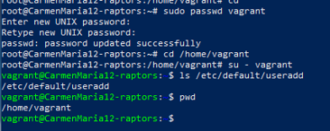

#Installing vagrant keys

**mkdir -pm 700 /home/vagrant/.ssh**,
creamos la carpeta de configuración SSH.

**wget --no-check-certificate 'https://raw.github.com/mitchellh/vagrant/master/keys/vagrant.pub' -O /home/vagrant/.ssh/authorized_keys**
descargamos la clave pública.

**chmod 0600 /home/vagrant/.ssh/authorized_keys**
, modificamos los permisos de la carpeta

**chown -R vagrant /home/vagrant/.ssh**
, modificamos el propietario de la carpeta.

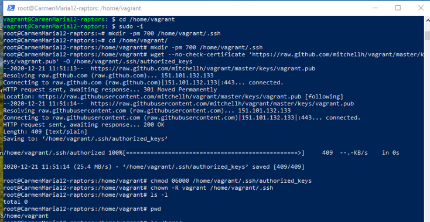

Sudoers

Tenemos que conceder permisos al usuario vagrant para que pueda hacer tareas privilegiadas como configurar la red, instalar software, montar carpetas compartidas, etc. Para ello debemos configurar el fichero /etc/sudoers (Podemos usar el comando visudo) para que no nos solicite la password de root, cuando realicemos estas operaciones con el usuario vagrant.

    Añadir vagrant ALL=(ALL) NOPASSWD: ALL al fichero de configuración /etc/sudoers. Comprobar que no existe una linea indicando requiretty si existe la comentamos.

**sudo nano /etc/sudoers**    

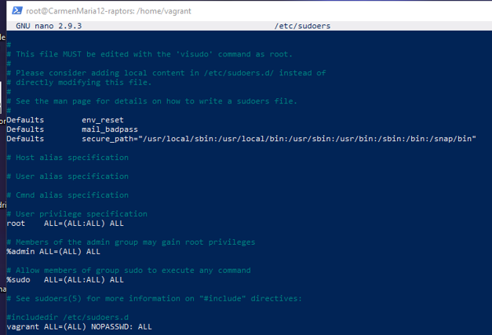    

Añadir las VirtualBox Guest Additions

    Debemos asegurarnos que tenemos instalado las VirtualBox Guest Additions con una versión compatible con el host anfitrión. Comprobamos:

root@hostname:~# modinfo vboxguest |grep version
version:        6.0.24

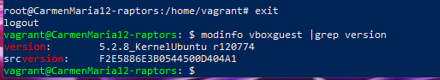   
    Apagamos la MV.

## 7.2 Crear caja Vagrant
  Una vez hemos preparado la máquina virtual ya podemos crear el box.

* Vamos a crear una nueva carpeta vagrantXX-bulls, para este nuevo proyecto vagrant. **md vagrant12-bulls**

* **VBoxManage list vms**, comando de VirtualBox que muestra los nombres de nuestras MVs. Elegir una de las máquinas (VMNAME).

* Nos aseguramos que la MV de VirtualBox VMNAME está apagada.

* vagrant package --base VMNAME --output nombre-alumnoXX.box, parar crear nuestra propia caja.

VMNAME=> **vagrant12-celtics_default_1608122792954_21414**

**carmenmaria12.box**

* Comprobamos que se ha creado el fichero nombre-alumnoXX.box en el directorio donde hemos ejecutado el comando. **dir**

* vagrant box add nombre-alumno/bulls nombre-alumnoXX.box, añadimos la nueva caja creada por nosotros, al repositorio local de cajas vagrant de nuestra máquina.

**vagrant box add carmenmaria/bulls carmenmaria12.box**

* vagrant box list, consultar ahora la lista de cajas Vagrant disponibles.

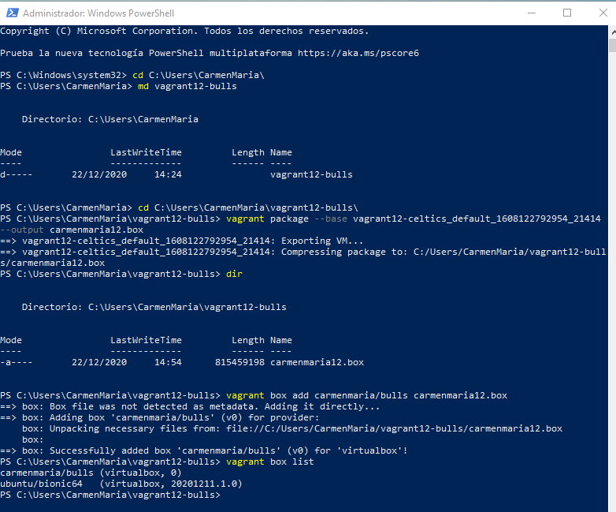

## 7.3 Usar la nueva caja

* Crear un nuevo fichero Vagrantfile para usar nuestra caja.

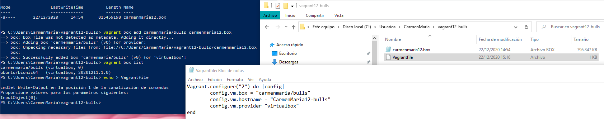

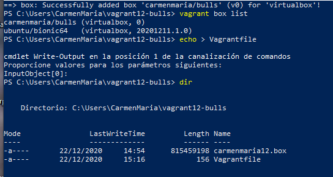

* Levantamos una nueva MV a partir del Vagranfile.

vagrant up

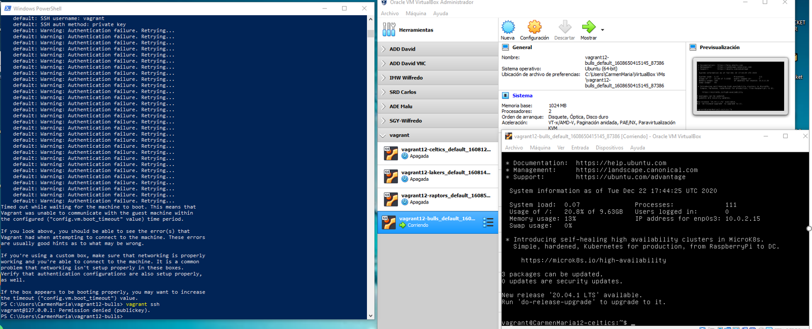

>NOTA: Me dió problemas y no me dejó conectar.

* Nos debemos conectar sin problemas (vagant ssh).

vagrant ssh

Cuando terminemos la práctica, ya no nos harán falta las cajas (boxes) que tenemos cargadas en nuestro repositorio local. Por tanto, podemos borrarlas para liberar espacio en disco:

* vagrant box list, para consultar las cajas disponibles.

* vagrant box remove BOXNAME, para eliminar una caja BOXNAME de nuestro repositorio local

>NOTA: Eliminé todas las MV de vagrant y la caja creada, pues no me permitía conectarme ssh en ninguna y volví a crear vagrant-celtics, huvo conexión ssh y utilicé esa para la nueva caja y ahún así me siguió dando el mismo fallo, puse conf.vm.timeout en Vagrantfile y tampoco.

 **vagrant destroy**
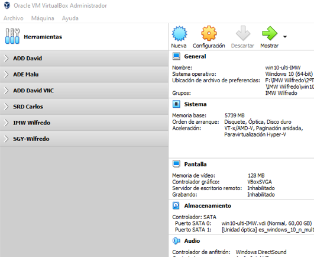
