#  1. Salt-stack

Hay varias herramientas conocidas del tipo gestor de infrastructura como Puppet, Chef, Ansible y Terraform. En esta actividad vamos a practicar Salt-stack con OpenSUSE.

## 1.1 Preparativos
|Config |	MV1 |	MV2 |	MV3|
|--|--|--|--|
Alias |	Master |	Minion |	Minion2
Hostname |	master12g |	minion12g |	minion12w
SO |	OpenSUSE |	OpenSUSE |	Windows
IP-clase |	172.19.12.31 |	172.19.12.32 |	172.19.12.11
IP-casa |192.168.1.131|192.168.1.132|192.168.1.111

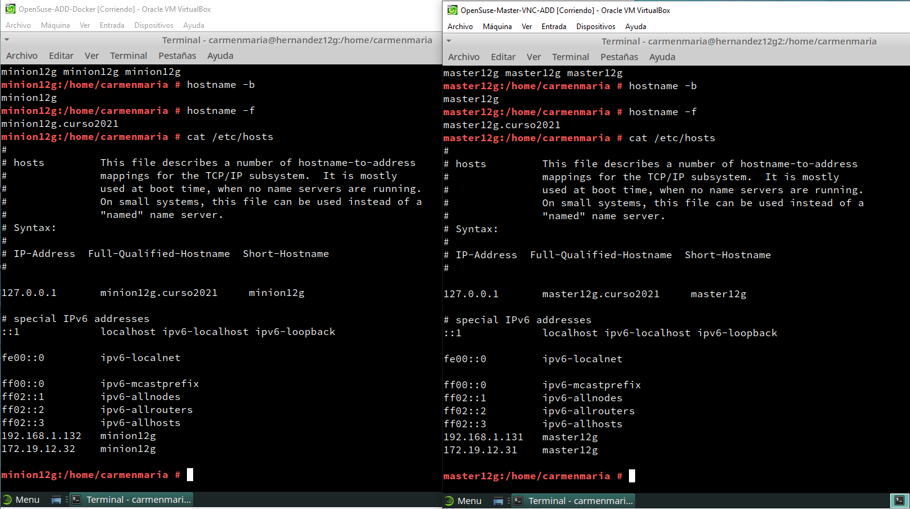

# 2. Master: instalar y configurar.

*   Ir a la MV1

*   zypper install salt-master, instalar el software del Máster.

    ATENCIÓN: El fichero de configuración siguiente tiene formato YAML.

    Los valores de clave(key) principal no tienen espacios por delante.

    El resto de valores de clave(key) secundarios tendrán 2 espacios o 4 espacios por delante.

    Hay que cumplir estas restricciones para que el contenido del dichero sea válido.

*   Modificar /etc/salt/master para configurar nuestro Máster con:

*  nano /etc/salt/master

interface: 172.19.XX.31
file_roots:
  base:
    - /srv/salt

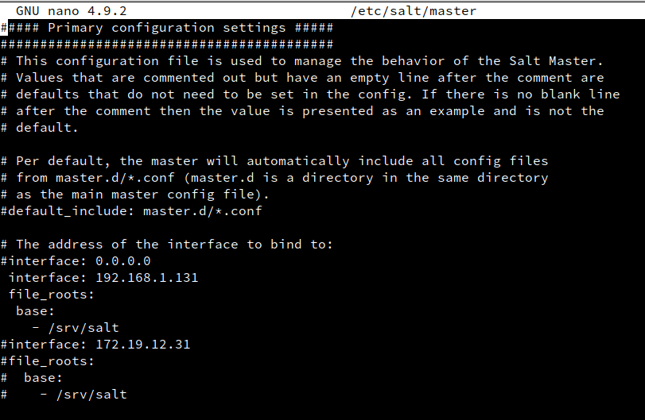

*  systemctl enable salt-master.service, activiar servicio en el arranque del sistema.

*   systemctl start salt-master.service, iniciar servicio.

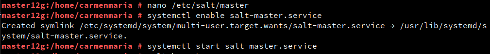

*  salt-key -L, para consultar Minions aceptados por nuestro Máster. Vemos que no hay ninguno todavía.

Accepted Keys:

Denied Keys:

Unaccepted Keys:

Rejected Keys:

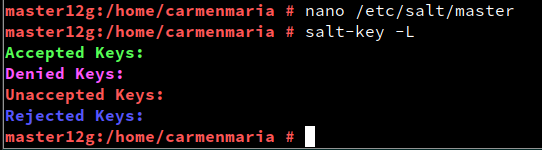

# 3. Minion

Los Minios son los equipos que van a estar bajo el control del Máster.
## 3.1 Instalación y configuración

* zypper install salt-minion, instalar el software del agente (minion).

* Modificar /etc/salt/minion para definir quien será nuestro Máster:

* nano /etc/salt/minion

master: 172.19.XX.31

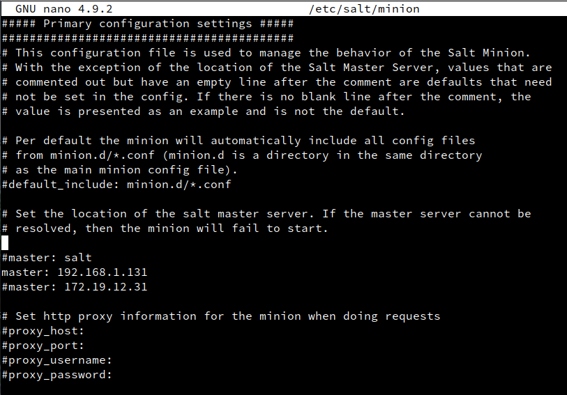

*  systemctl enable salt-minion.service, activar Minion en el arranque del sistema.

*  systemctl start salt-minion.service, iniciar el servico del Minion.

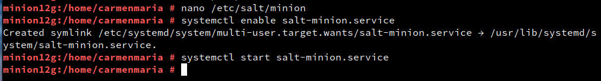

*  Comprobar que que no tenemos instalado apache2 en el Minion.

* rpm -qa --last | head

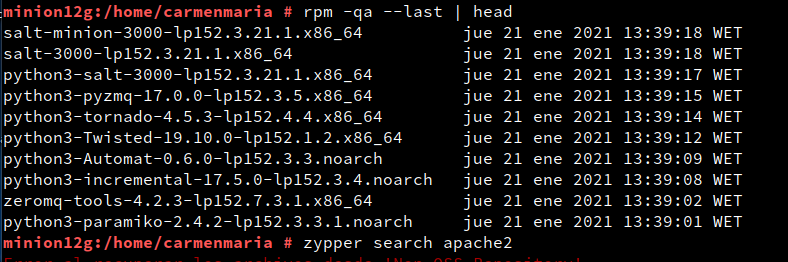

* which apache2

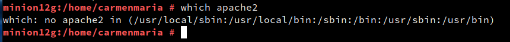

## 3.2 Cortafuegos

Hay que asegurarse de que el cortafuegos permite las conexiones al servicio Salt. Consultar URL Opening the Firewall up for Salt

*   Ir a la MV1 Máster.

*   firewall-cmd --get-active-zones, consultar la zona de red. El resultado será public, dmz o algún otro. Sólo debe aplicar a las zonas necesarias.

*  firewall-cmd --zone=public --add-port=4505-4506/tcp --permanent, abrir puerto de forma permanente en la zona "public".

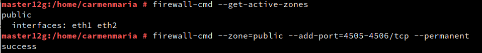

*  firewall-cmd --reload, reiniciar el firewall para que los cambios surtan efecto.

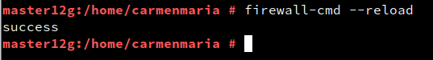

## 3.3 Aceptación desde el Master

* Ir a MV1:

* salt-key -L, vemos que el Máster recibe petición del Minion.

Accepted Keys:

Denied Keys:

Unaccepted Keys:

minionXXg

Rejected Keys:

* salt-key -a minionXXg, para que el Máster acepte a dicho Minion.

* salt-key -L, comprobamos.

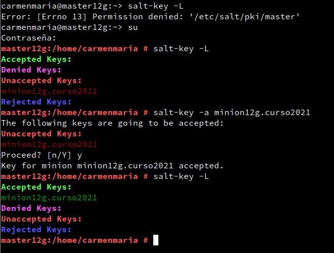

## 3.4 Comprobamos conectividad

Desde el Máster comprobamos:

1.  Conectividad hacia los Minions.

#salt '*' test.ping

minionXXg:
    True

2.    Versión de Salt instalada en los Minions

#salt '*' test.version

minionXXg:
    2019.2.0

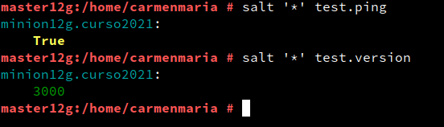

  El símbolo '*' representa a todos los minions aceptados. Se puede especificar un minion o conjunto de minios concretos.

#  4. Salt States

  Enlaces de interés:

  •	Learning SaltStack - top.sls (1 of 2)

  •	Learning SaltStack - top.sls (2 of 2)

  •	Repositorio GitHub con estados de ejemplo

##  4.1 Preparar el directorio para los estados

  Vamos a crear directorios para guardar lo estados de Salt. Los estados de Salt son definiciones de cómo queremos que estén nuestras máquinas.

  Ir a la MV Máster:

  •	Crear directorios /srv/salt/base y /srv/salt/devel.

  •	Crear archivo /etc/salt/master.d/roots.conf con el siguiente contenido:

  file_roots:

    base:
      - /srv/salt/base
    devel:
      - /srv/salt/devel

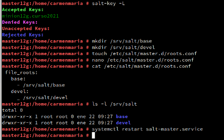

  •	Reiniciar el servicio del Máster.
  Hemos creado los directorios para:

  •	base = para guardar nuestros estados.

  •	devel = para desarrollo o para hacer pruebas.

##  4.2 Crear un nuevo estado

  Los estados de Salt se definen en ficheros SLS.

  •	Crear fichero /srv/salt/base/apache/init.sls:

  install_apache:

    pkg.installed:
      - pkgs:
        - apache2

  apache_service:

    service.running:
      - name: apache2
      - enable: True
      - require:
        - pkg: apache2
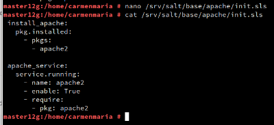

Para que funcionara se tubieron que comentar dos apartados:

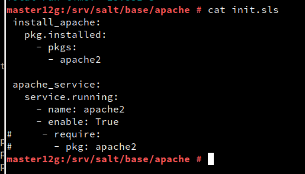

  Entendamos las definiciones:

  •	Nuestro nuevo estado se llama apache porque el directorio donde están las definiciones se llama srv/salt/base/apache.

  •	La primera línea es un identificador (Por ejemplo:
     install_apache o apache_service), y es un texto que ponemos nosotros libremente, de forma que nos ayude a identificar lo que vamos a definir.

  •	pkg.installed: Es una orden de salt que asegura que los paquetes estén instalados.

  •	service.running: Es una orden salt que asegura de que los servicios estén iniciados o parados.

##  4.3 Asociar Minions a estados

  Ir al Máster:

  •	Crear /srv/salt/base/top.sls, donde asociamos a todos los Minions con el estado que acabamos de definir.

  base:       
    '*':
      - apache

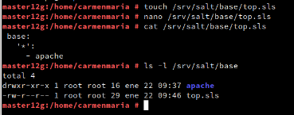

##  4.4 Comprobar: estados definidos

  •	salt '*' state.show_states, consultar los estados que tenemos definidos para cada Minion:

  minionXXg:

      - apache

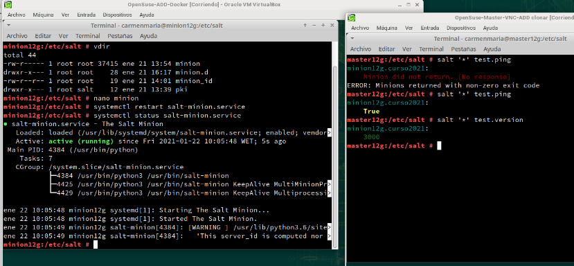

Para que funcionara se tubo que comentar la ip de casa y descomentar la ip de clase en el fichero /etc/salt/master,
y enla MV de minion también hacer lo mismo en el fichero /etc/salt/minion.
También fue necesario cerrar la tarjeta de red de casa y abrir la de clase.

##  4.5 Aplicar el nuevo estado

  Ir al Master:

  •	Consultar los estados en detalle y verificar que no hay errores en las definiciones.

  o	salt '*' state.show_lowstate

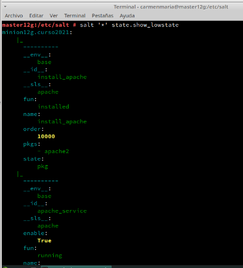

  o	salt '*' state.show_highstate,

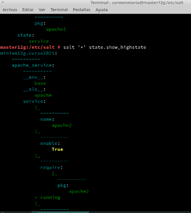

  •	salt '*' state.apply apache, para aplicar el nuevo estado en todos los minions. OJO: Esta acción puede tardar un tiempo.

  minionXXg:
  ----------
            ID: install_apache
      Function: pkg.installed
        Result: True
       Comment: The following packages were installed/updated: apache2
                ...
  ----------
            ID: apache_service
      Function: service.running
          Name: apache2
        Result: True
       Comment: Service apache2 has been enabled, and is running
                ...

  Summary for minionXXg
  ------------
  Succeeded: 2 (changed=2)
  Failed:    0
  ------------
  Total states run:     2
  Total run time: 105.971 s
  NOTA: Con este comando salt '*' state.highstate, también se pueden invocar todos los estados.

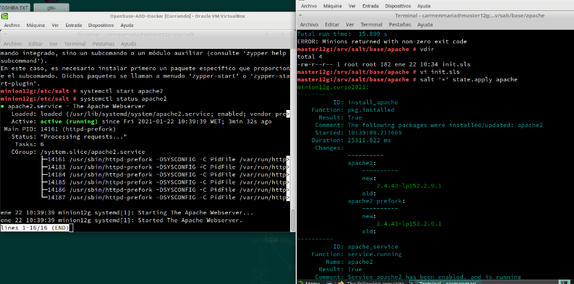

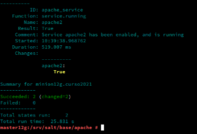

  ________________________________________

#  5. Crear más estados

Compruebo que las dos MV están funcionando.

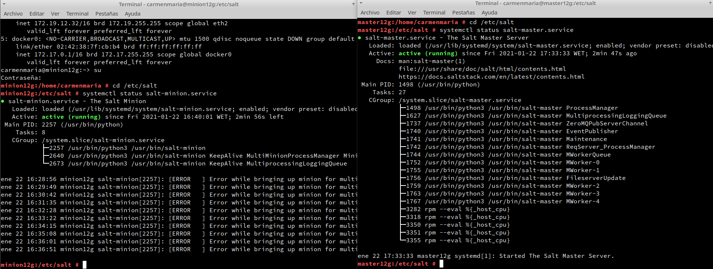

##  5.1 Crear estado "users"

  Enlaces de interés:

  •	Create groups

  •	Create users

  Vamos a crear un estado llamado users que nos servirá para crear un grupo y usuarios en las máquinas Minions.

  •	Crear directorio /srv/salt/base/users.

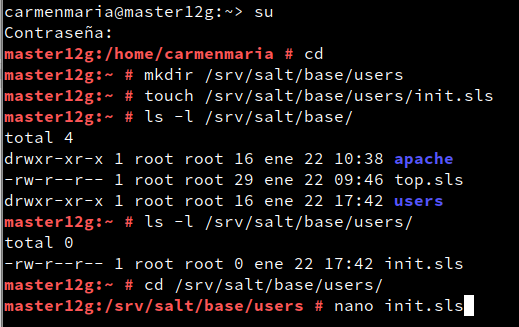

  •	Crear fichero /srv/salt/base/users/init.sls con las definiones para crear los siguiente:

  o	Grupo mazingerz

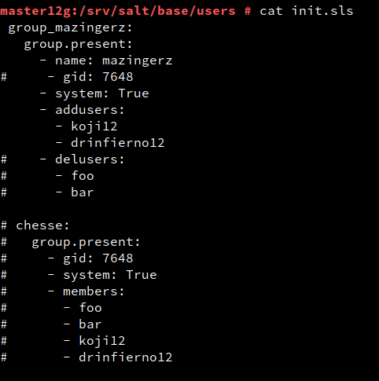

  o	Usuarios kojiXX,
   drinfiernoXX dentro de dicho grupo.

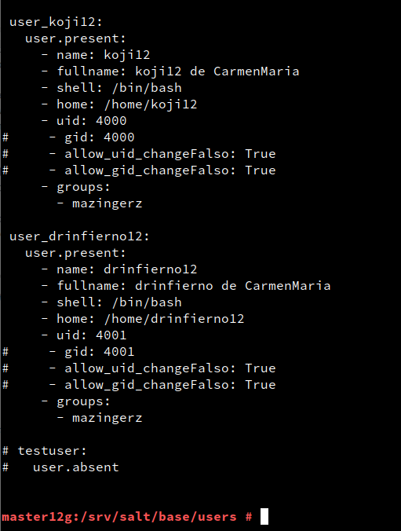

  •	Aplicar el estado.

salt '*' state.apply users

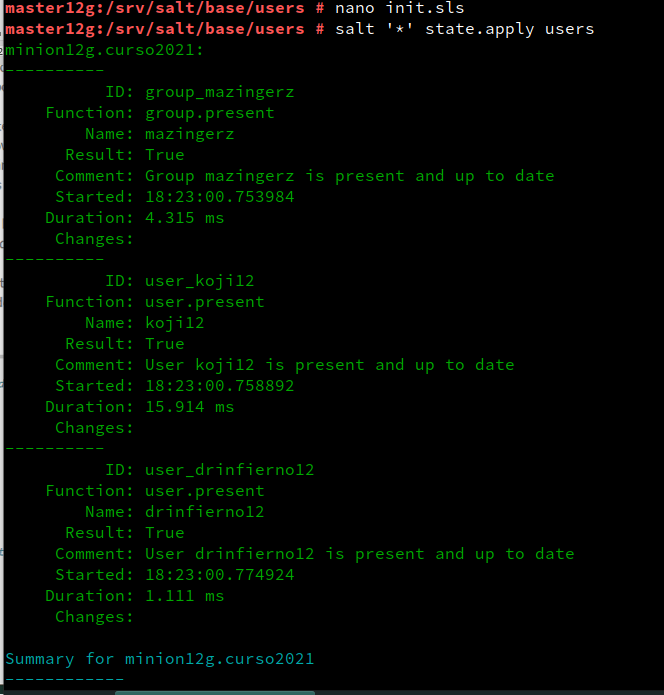

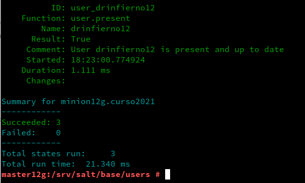

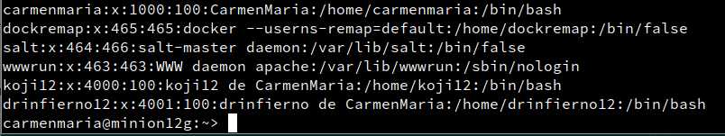

##  5.2 Crear estado "files"

  Enlace de inteŕes:

  •	Gestión de ficheros

•	Crear estado files
   para crear las carpetas private (700), public (755) y group (750) en el home del usuario koji (ver ejemplos en el ANEXO).

   *   Crear directorio /srv/salt/base/files.

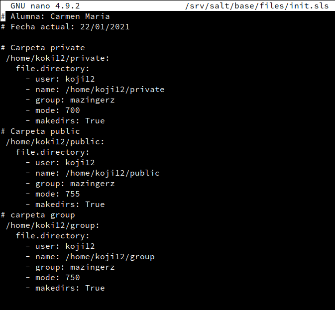

   *  Crear fichero /srv/salt/base/files/init.sls   

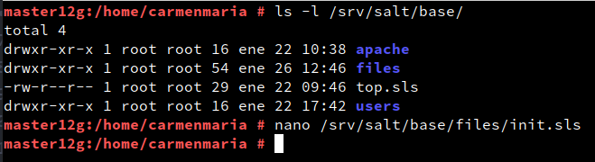

  •	Aplicar el estado files.

salt '*' state.apply files  

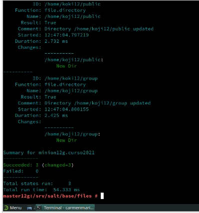

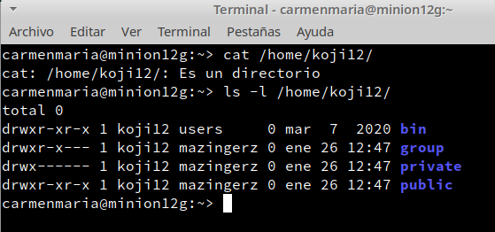

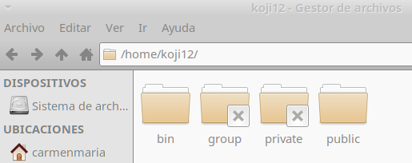

##  5.3 Ampliar estado "apache"

  •	Crear el fichero srv/salt/archivo/holamundo.html. Escribir dentro el nombre del alumno y la fecha actual.

mkdir /srv/salt/base/archivo

touch /srv/salt/base/archivo/holamundo.html

  •	Incluir en el estado "apache" la creación del fichero /srv/www/htdocs/holamundo.html en el Minion. Dicho fichero se descargará desde el servidor Salt Máster.

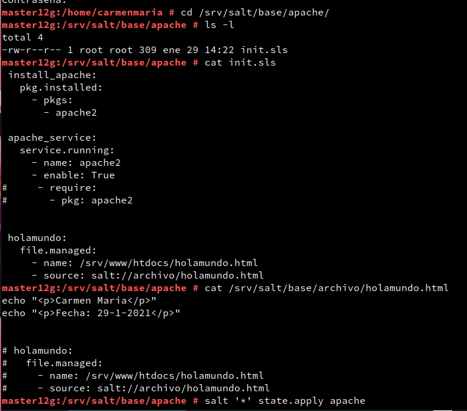

  •	Aplicar el estado.

salt '*' state.apply apache

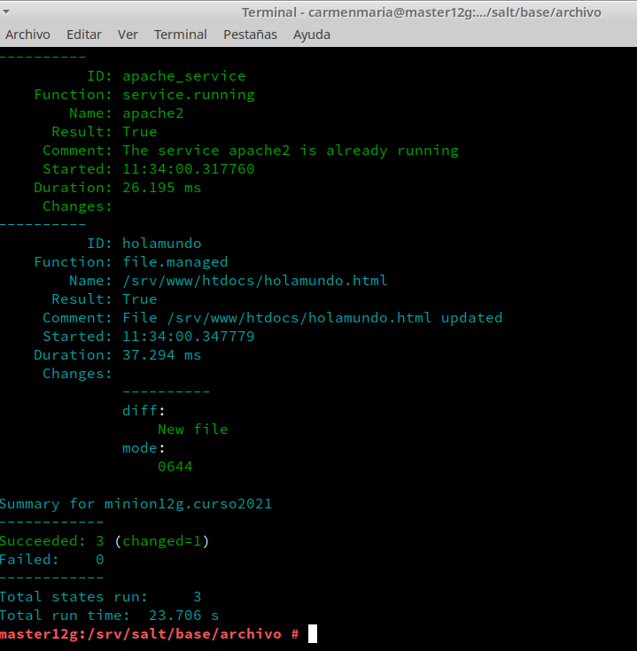

>Nota: Ha ocurrido que al aplicar el estado apache me daba error de instalación.
* Ir a la MV Minion :
*    systemctl status apache=> ver el estado de apache2
*  systemctl stop apache=> parar el servicio de apache si esta activado.
*  zypper remove apache2=>elimino apache.

En la MV Master ya puedo volver a aplicar el estado apache.

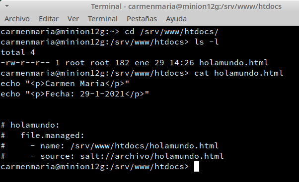

Como podemos comprobar el fichero se ha descargado correctamente desde la MV SaltMáster en la MV SaltMinion

>NOTA: en el fichero:
*  "name " se pone la ruta donde va a ser instalado el fichero en la MV  Minion.
* "sourse" se pone la ruta donde ha sido creado el fichero holamundo de la MV Master.
